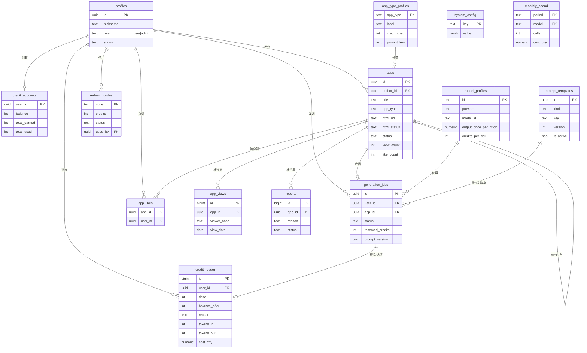
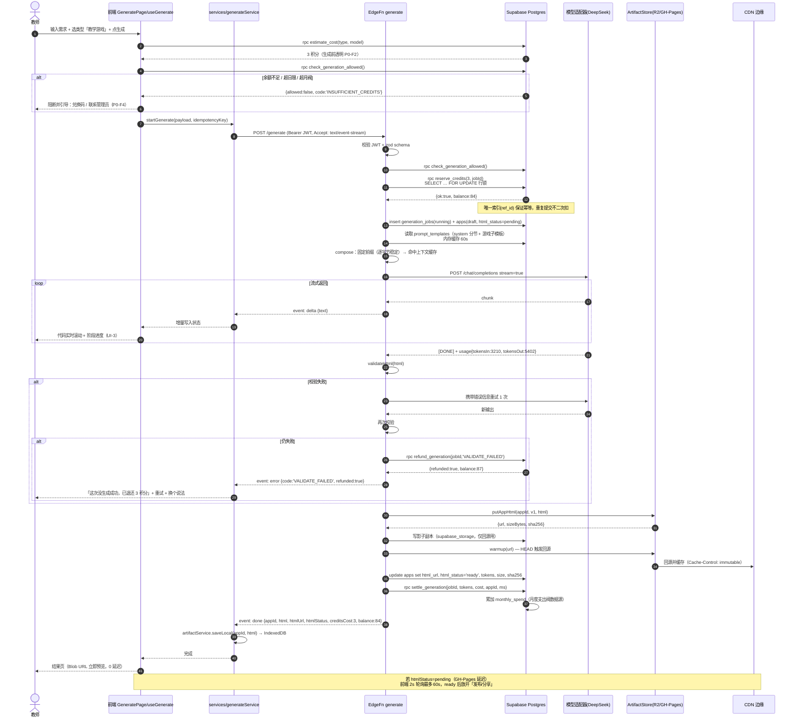
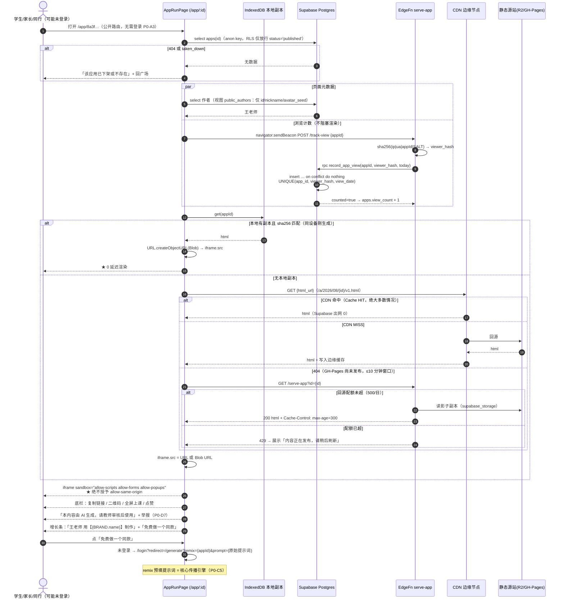
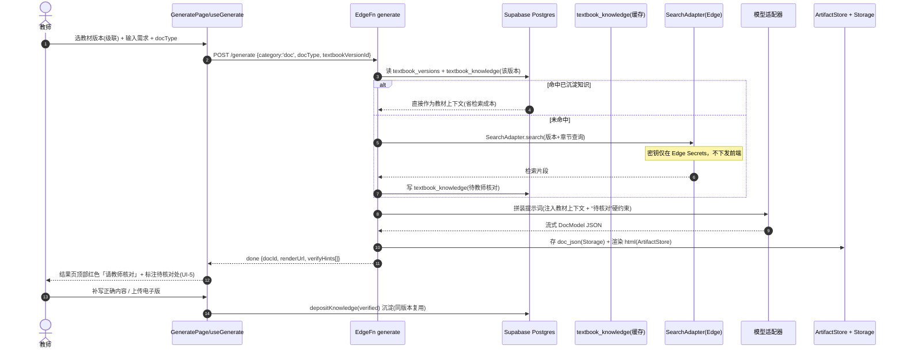
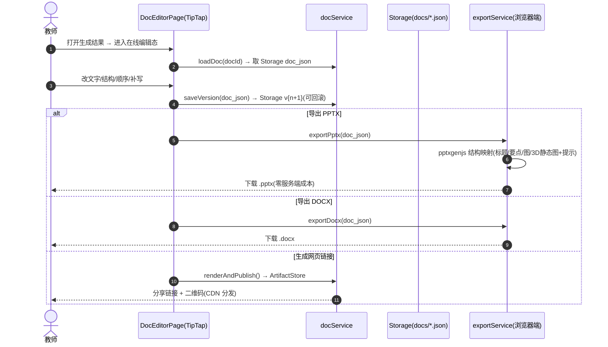

# 系统架构设计 + 任务分解

| 项目信息 | 内容 |
| --- | --- |
| 文档语言 | 简体中文 |
| 文档版本 | v1.0 |
| 撰写人 | 高见远（架构师） |
| 上游输入 | `docs/PRD.md` v1.0（许清楚） |
| 项目代号 | `teacher_ai_app_studio`（产品名待客户拍板 → 见 §7 待明确 Q1） |
| 项目根目录 | `F:\work buddy\数据\教师软件开发\` |
| 读者 | 寇豆码（工程师，本文档 §6 任务列表是其直接输入）、严过关（测试） |

---

## 0. 一图看懂（总体架构）

```
                         ┌───────────────────────────────────────────┐
   教师 / 学生 / 访客     │  浏览器 / PWA（Vite + React + MUI + TW）   │
                         │  全部数据访问 → src/services/*（唯一出口） │
                         └───────────────┬───────────────────────────┘
                                         │
        ┌────────────────────────────────┼─────────────────────────────────┐
        │ 轻流量（元数据/Auth/RPC）        │ 重流量（应用 HTML，100–200KB/次）│
        ▼                                ▼                                 ▼
┌────────────────────┐      ┌────────────────────────┐      ┌──────────────────────┐
│ Supabase           │      │ Supabase Edge Function │      │ 静态托管 + CDN        │
│  - Auth            │◄────►│  - generate（SSE）      │      │  Cloudflare Pages/R2 │
│  - Postgres + RLS  │      │  - serve-app（回源兜底）│      │  （或 GitHub Pages）  │
│  - RPC（积分/点赞） │      │  - track-view（浏览）   │      │  路径 /a/{id}/v1.html │
└────────────────────┘      └───────────┬────────────┘      └──────────▲───────────┘
                                        │ 只在此处持有 API Key           │
                                        ▼                               │ 写入
                          ┌──────────────────────────┐                  │
                          │ 大模型适配器层            │                  │
                          │ DeepSeek(默认)/通义/GLM/豆包│                 │
                          └──────────────────────────┘                  │
                                        │                               │
                                        └───── 生成产物 ────────────────┘
                                              ArtifactStore（可插拔）
```

**一句话架构结论**：Supabase 只做「身份 + 元数据 + 生成编排」，应用 HTML 永不经过 Supabase 出网，改由静态托管 + CDN 边缘分发；前端所有数据访问收敛到 `src/services/` 单一层；模型与存储都做成适配器，客户后续拍板的任何一项只改配置不改结构。

---

# Part A：系统设计

## 1. 实现方案与框架选型

### 1.1 核心技术难点

| # | 难点 | 架构对策 |
| --- | --- | --- |
| D1 | **Supabase 出网 10GB 红线**：一个 100KB 应用被打开 10 万次 = 10GB，会被直接打爆 | 应用 HTML 写入**外部静态托管/CDN**（§2.1 存储与分发方案），Supabase 只承担：Auth（~1KB/次）、元数据列表（~20KB/页）、生成接口（~10KB/次）、浏览计数（~350B/次）。按 10 万次打开测算 ≈ 35MB，「安全余量 > 280 倍」 |
| D2 | **成本与体验解耦**：模型价格 2026-08 已大涨（最高 1100%），且备课高峰恰好落在高价时段 | 三层解耦：① 用户只看「积分」，按**应用类型**计价，与 token 完全无关；② 平台侧按真实 token × 单价记账到 `monthly_spend`；③ 全局月度支出上限阀（`system_config.limit.monthly_spend_cny`），超限降级提示 |
| D3 | **上下文缓存命中**：命中 0.1 元/百万 vs 未命中 3 元/百万，差 30 倍 | 系统提示词作为**逐字节稳定的固定前缀**放在 `messages[0]`，禁止插入时间戳/随机数/用户信息；8 类子模板追加在 system 段末（按类型固定，仍可缓存）；结构化字段拼进 **user** 消息而非 system |
| D4 | **积分原子性**：预扣、失败退还、并发不超额 | 全部走 Postgres `SECURITY DEFINER` 函数 + `SELECT ... FOR UPDATE` 行锁 + 幂等唯一索引（按 job_id），前端只做展示不做判断 |
| D5 | **生成延迟与"生成后立即可访问"**：GitHub Pages 类静态托管发布有 10–60s 延迟 | 三管齐下：① SSE 末事件回传完整 HTML → 前端 IndexedDB 缓存 → Blob URL 立即渲染（0 延迟预览）；② 写完 origin 后 Edge Function 主动预热（HEAD）；③ `html_status` 三态 + 前端轮询就绪后才放开「发布/分享」 |
| D6 | **安全**：生成物是不可信第三方代码 | iframe `sandbox="allow-scripts allow-forms allow-popups"`（**绝不加 `allow-same-origin`**）+ 无 `srcdoc` 同源注入 + 单文件 200KB 上限 + RLS 全表开启 |
| D7 | **提示词是产品成败核心，需要能不发版就调优** | 系统提示词存 DB `prompt_templates` 表（分节存储 + 版本号 + `is_active`），Edge Function 内存缓存 60s；每次生成把 `prompt_version` 写进 `generation_jobs`，可归因失败率 |
| D8 | **客户 3 项未拍板（平台名/登录/模型）** | 三项全部做成**配置 + 适配器**，代码零硬编码（§3.6） |
| D9 | **Supabase 免费层「连续 1 周无访问自动暂停」**（假期后打不开） | GitHub Actions 定时唤醒（`.github/workflows/keepalive.yml`，每 3 天 ping 一次 health RPC），零成本 |

### 1.2 为什么是「Supabase + 静态托管」混合，而不是纯 Supabase

| 方案 | 评价 | 结论 |
| --- | --- | --- |
| **纯 Supabase**（HTML 存 Storage/DB，直接分发） | 实现最简单 | ❌ **否决**。出网 10GB 红线必被打爆；DB 500MB 也会很快耗尽；一旦超限项目转只读，全站瘫痪 |
| **纯静态托管 + Serverless 函数**（无 BaaS） | 带宽充裕 | ❌ 否决。Auth、RLS、事务、实时都要从零造，P0 时间成本不可接受，且要接短信/邮箱服务 |
| **Supabase（Auth+DB+编排） + 外部静态托管/CDN（产物分发）** | 各取所长：Supabase 只跑「小而贵」的控制面，CDN 跑「大而便宜」的数据面 | ✅ **采纳** |

补充理由：
1. **成本结构匹配**：Supabase 免费层的稀缺资源是「出网」（10GB），充裕资源是「Auth MAU 5万 / Edge Function 50万次 / DB 500MB」；静态托管（Cloudflare Pages/R2/GitHub Pages）的稀缺资源反过来。混合后两边都落在免费区内。
2. **R2 出网免费**：Cloudflare R2 免费层 10GB 存储且**出网 0 元**，天然适配"写一次读十万次"的产物分发场景。
3. **换后端成本可控**：HTML 已经在外部托管，将来即使 Supabase 换掉，历史链接依然可访问——这是纯 Supabase 方案做不到的**资产沉淀**优势。

### 1.3 框架与库选型

| 层 | 选型 | 理由 |
| --- | --- | --- |
| 构建 | **Vite 5** | 冷启动快、产物小；`vite-plugin-pwa` 0.20.x 与 Vite 5 兼容性已验证（Vite 6 需 0.21+，P0 不冒险） |
| UI 框架 | **React 18** | 生态最稳；MUI v6 官方支持 React 18 |
| 组件库 | **MUI v6 + Emotion** | 中文场景的表单/对话框/移动适配开箱即用；`theme.ts` 一处改全局，便于"平台名/主色"品牌化 |
| 样式 | **Tailwind CSS 3.4** | ⚠️ **锁 v3 不用 v4**：v4 的 PostCSS 插件与 CSS-first 配置与 MUI 的 Emotion 注入顺序有冲突风险，且 v3 资料/Typography Plugin 更成熟 |
| 路由 | **react-router-dom 6** | 事实标准，支持 `/app/:id` 公开路由与登录重定向 |
| PWA | **vite-plugin-pwa（Workbox，generateSW）** | 离线启动壳 + 图标 + manifest；离线时展示友好提示（不要求离线生成） |
| BaaS | **Supabase**（Auth + Postgres + Edge Functions） | 免费层够用；Postgres 原生支持我们所需的**事务/行锁/RLS/SECURITY DEFINER 函数**，这是积分原子性的基石 |
| Edge Runtime | **Deno（Supabase Edge Functions 原生）** | 原生 `fetch`/SSE/Streams，无需额外依赖；密钥走 Supabase Secrets |
| 大模型 | **DeepSeek-V4-Flash（默认）** | 中文强、有上下文缓存、便宜；通过适配器层可切通义/GLM/豆包 |
| 二维码 | **qrcode.react 4** | 纯前端生成，零请求零流量 |
| 本地缓存 | **idb 8** | 刚生成的 HTML 存 IndexedDB，实现"0 延迟预览"与 CDN 未就绪降级 |
| 校验 | **zod 3** | Edge Function 入参校验 + 前端表单；前后端共用 `src/types` 契约 |

---

## 2. 应用 HTML 的存储与分发方案（对应 PRD 4.2 硬要求）

### 2.1 存储分层与可插拔 ArtifactStore

产物写入抽象为统一接口，运行时由 `system_config.artifact.provider` 决定实现（默认 `r2`，零域名时降级 `github_pages`）：

```ts
// supabase/functions/_shared/store/types.ts
export interface PutResult { url: string; sizeBytes: number; sha256: string; readyNow: boolean }
export interface ArtifactStore {
  readonly name: 'r2' | 'github_pages' | 'supabase_storage';
  putAppHtml(appId: string, version: number, html: string): Promise<PutResult>;
  getAppHtml(appId: string, version: number): Promise<string | null>; // 回源兜底
  warmup(url: string): Promise<void>;                                  // CDN 预热（HEAD）
  deleteAppHtml(appId: string, version: number): Promise<void>;
}
```

| Provider | 免费额度 | 写入即读 | 自定义响应头 | 国内可达 | 前置条件 | 超出代价 |
| --- | --- | --- | --- | --- | --- | --- |
| **r2**（默认） | 10GB 存储 / 100万 Class A / 1000万 Class B / **出网免费** | ✅ 强一致 | ✅ 可设 immutable | 中（绑定域名后走 CF 边缘） | Cloudflare 账号；公开读建议绑自定义域名 | $0.015/GB-月 |
| **github_pages**（零门槛降级） | 仓库建议 ≤1GB / 100GB 月带宽软限 | ❌ 发布延迟 10–60s | ❌ 不可自定义 | 中 | GitHub 账号 + PAT（fine-grained，`Contents: write`） | 限流或要求缩减 |
| **supabase_storage**（仅影子副本/回源） | 1GB / 出网计入 10GB | ✅ | 部分 | 好 | 无 | ⚠️ 出网超限项目暂停 |

> **P0 落地策略**：先按 `github_pages` 跑通（零门槛、无需绑卡、无需域名），`r2` 适配器同步实现好，客户拍板域名（Q8）后改一行 `system_config` 即可切换。两条路径共用同一套路径命名与回源逻辑，切换无代码改动。

### 2.2 路径命名

```
r2 / pages 路径：  a/{yyyy}/{mm}/{appId}/v{version}.html
影子副本路径：      apps-html/{yyyy}/{mm}/{appId}/v{version}.html   （supabase_storage，仅回源）
对外 URL：         {artifact.base_url}/a/{yyyy}/{mm}/{appId}/v{version}.html
```

- `{appId}` = UUIDv4（`gen_random_uuid()`），不可枚举；
- `{version}` 从 1 起，**内容不可变**——P0 无代码编辑，版本恒为 1，但路径预留版本位，使 CDN 可安全设置长缓存；
- 按月分目录，避免单目录文件过多（GitHub Pages 单仓库 2 万文件上限）；
- `apps.html_url` 存完整对外 URL，`apps.html_sha256` 用于本地 IndexedDB 副本一致性校验。

### 2.3 CDN 缓存策略

| 资源 | Cache-Control | 说明 |
| --- | --- | --- |
| `/a/*/v*.html`（应用产物） | `public, max-age=31536000, immutable` | 路径含 appId+version，天然版本化，永不原地覆盖 → 可放心一年强缓存 |
| `/serve-app?id=xxx`（回源兜底） | `public, max-age=300` | 低频；仅当产物状态为 `pending` 或发布 ≤10 分钟且当日回源预算未超 |
| 广场列表 RPC（`apps` 元数据） | 客户端 SWR 60s + HTTP `max-age=0, must-revalidate` | 每页 ≤ 24 条，单页响应 ≤ 20KB |
| PWA 壳（`index.html` + Workbox 预缓存） | Workbox `NetworkFirst`，SW 资产 `CacheFirst` | 离线可启动，离线时展示友好提示 |
| 封面 | 程序生成 SVG/CSS 渐变（零存储零流量），**不上传图片** | 见 §5.6 |

CDN 规则（Cloudflare 免费计划，绑定域名后）：`Cache Rule: hostname 匹配 且 path 匹配 /a/* → Cache Everything, Edge TTL = 1 年`。

### 2.4 如何做到「生成后立即可访问」

四道保险，按优先级：

1. **本地直渲染（0 延迟）**：`generate` 的 SSE 末事件 `done` 携带完整 HTML 字符串 → 前端 `artifactService.saveLocal()` 写入 IndexedDB → 结果页与 `/app/:id` 用 `URL.createObjectURL(new Blob([html], {type:'text/html'}))` 作为 iframe `src`，**同设备立即渲染，不依赖任何网络**。
2. **服务端预热**：`generate` 写完 origin 后立即 `store.warmup(url)` 发一次 HEAD，触发 CDN 回源与边缘缓存。
3. **状态机 + 前端轮询**：`apps.html_status ∈ {pending, ready, failed}`。发布/分享按钮在 `pending` 时禁用并轮询（2s/次，最多 60s）；`ready` 后放开。GitHub Pages 场景下这是唯一有感知的等待，且只影响"分享给别人"这一动作，不影响自己预览。
4. **回源兜底（跨设备立刻分享场景）**：`/app/:id` 若本地无副本且 CDN 探测 404 → 调 `serve-app` Edge Function 从影子副本直出，`Cache-Control: max-age=300`。触发条件双重限流：仅当 `published_at` 在 10 分钟内 **且** 当日全局回源次数 < 配置上限（默认 500 次/日，≈100MB，占 10GB 出网的 1%）。

> **出网核算（MVP 目标：月出网 < 5GB）**
> 10 万次应用打开：产物走 CDN（Supabase 出网 0）+ `track-view` 100000 × 350B ≈ **35MB**
> 广场浏览 1 万次 × 20KB ≈ 200MB；生成 2000 次 × 15KB ≈ 30MB；Auth/RPC 杂项 ≈ 50MB
> **合计 ≈ 315MB/月**，远低于 5GB 目标线。

---

## 3. 数据结构与接口

### 3.1 数据库 ER 图（Mermaid）



### 3.2 表设计（DDL 要点，完整脚本见 §4 迁移文件列表）

**① `profiles`**（`auth.users` 的公开扩展）
```
id uuid PK → auth.users(id) ON DELETE CASCADE
nickname text NOT NULL DEFAULT '老师'
avatar_seed text NOT NULL DEFAULT ''        -- 用于程序化生成头像（零存储）
role text NOT NULL DEFAULT 'user'  CHECK (role IN ('user','admin'))
subject text / grade text / school text      -- 选填，用于个性化默认值
status text NOT NULL DEFAULT 'active' CHECK (status IN ('active','disabled'))
created_at / updated_at timestamptz
```

**② `credit_accounts`**（积分账户，唯一余额真相源）
```
user_id uuid PK → profiles(id) ON DELETE CASCADE
balance      integer NOT NULL DEFAULT 0 CHECK (balance >= 0)   -- 硬约束：不允许为负
total_earned integer NOT NULL DEFAULT 0
total_used   integer NOT NULL DEFAULT 0
updated_at   timestamptz
```

**③ `credit_ledger`**（积分流水，只增不改）
```
id bigserial PK
user_id uuid NOT NULL → profiles(id)
delta integer NOT NULL                     -- 正=收入 负=支出
balance_after integer NOT NULL
reason ledger_reason_enum NOT NULL          -- register_gift|generate_reserve|generate_refund|publish_reward|redeem_code|admin_adjust
ref_type text / ref_id text                 -- 关联 job_id / code
tokens_in int DEFAULT 0 / tokens_out int DEFAULT 0
model text / cost_cny numeric(10,4) DEFAULT 0   -- 平台侧真实成本记账
memo text / created_at timestamptz
-- 幂等：防止重复预扣 / 重复退还
CREATE UNIQUE INDEX ON credit_ledger(ref_id) WHERE ref_type='generate_reserve';
CREATE UNIQUE INDEX ON credit_ledger(ref_id) WHERE ref_type='generate_refund';
```

**④ `apps`**（应用元数据，**不存 HTML 正文**）
```
id uuid PK DEFAULT gen_random_uuid()
author_id uuid NOT NULL → profiles(id) ON DELETE CASCADE
title text NOT NULL / summary text NOT NULL DEFAULT ''
app_type app_type_enum NOT NULL DEFAULT 'auto'
subject / grade / textbook / duration / difficulty text
prompt_raw text NOT NULL / prompt_enhanced text NOT NULL DEFAULT ''
model text NOT NULL DEFAULT '' / prompt_version text NOT NULL DEFAULT ''
html_url text / html_status html_status_enum NOT NULL DEFAULT 'pending'
html_size_bytes int DEFAULT 0 / html_sha256 text DEFAULT '' / html_version int DEFAULT 1
cover_kind text DEFAULT 'auto' / cover_seed text DEFAULT '' / cover_url text
status app_status_enum NOT NULL DEFAULT 'draft'   -- draft|published|taken_down
published_at timestamptz
view_count int DEFAULT 0 / like_count int DEFAULT 0 / remix_count int DEFAULT 0
credits_cost int DEFAULT 0 / tokens_in int DEFAULT 0 / tokens_out int DEFAULT 0
generation_ms int DEFAULT 0
parent_app_id uuid → apps(id)                     -- remix 来源
created_at / updated_at timestamptz
```
索引：`(status, published_at DESC)`、`(status, view_count DESC)`、`(status, like_count DESC)`、`(app_type, status, published_at DESC)`、`(author_id, created_at DESC)`、`pg_trgm(title)`（搜索）。

**⑤ `app_likes`**　`(app_id, user_id) PK`，`created_at`
**⑥ `app_views`**（浏览去重）　`id bigserial PK / app_id / viewer_hash text / view_date date / created_at`，`UNIQUE(app_id, viewer_hash, view_date)`
> `viewer_hash = sha256(ip + '|' + ua + '|' + app_id + '|' + SECRET_SALT)`，**不存明文 IP**（学生隐私 + 省存储）。

**⑦ `reports`**　`id / app_id / reporter_id nullable / reporter_hash / reason / detail / status(pending|handled|dismissed) / created_at / handled_by / handled_at`

**⑧ `redeem_codes`**　`code text PK（10 位大写，剔除 0/O/1/I）/ credits int / batch_no text / status(unused|used|disabled) / used_by uuid / used_at / expires_at / created_by / created_at`

**⑨ `system_config`**　`key text PK / value jsonb / description / updated_at / updated_by`（见 §3.6 配置项清单）

**⑩ `model_profiles`**（模型适配器配置表）
```
id text PK                    -- 'deepseek-v4-flash'
provider text                 -- 'deepseek'|'qwen'|'glm'|'doubao'
model_id text                 -- 厂商 API 的 model 字段
display_name text
pricing jsonb                 -- {input, cachedInput, output, peakMultiplier} 元/百万 token
max_output_tokens int DEFAULT 8000
credits_per_call int          -- 名义积分（实际按 app_type 计，此列仅展示/兜底）
is_default bool / enabled bool / sort_order int
```

**⑪ `app_type_profiles`**（8 类 + 自动判断）
```
app_type app_type_enum PK / label text / credit_cost int / model_override text NULL / prompt_key text / sort_order int / enabled bool
```

**⑫ `prompt_templates`**（提示词版本管理，见 §5.1）
```
id uuid PK / kind text（system_section|app_type|user_enhance|repair）
key text / version int / content text / is_active bool / created_at / created_by
CREATE UNIQUE INDEX prompt_templates_active_uidx ON prompt_templates(key) WHERE is_active;
```

**⑬ `monthly_spend`**（全局月度支出阀的数据源）
```
(period text 'YYYY-MM', model text) PK / provider text / calls int / tokens_in bigint / tokens_out bigint / cost_cny numeric(12,4) / updated_at
```

**⑭ `generation_jobs`**（并发控制 + 预扣退还的幂等锚点）
```
id uuid PK / user_id / app_id NULL / app_type / model / status(running|succeeded|failed|cancelled)
reserved_credits int / tokens_in int / tokens_out int / cost_cny numeric(10,4)
prompt_version text / error_code text / error_message text / started_at / finished_at
-- 并发：单用户同时只允许 1 个 running
CREATE UNIQUE INDEX gen_jobs_running_uidx ON generation_jobs(user_id) WHERE status='running';
```

**⑮ `generation_daily`**　`(user_id, day date) PK / count int` —— 每日 30 次上限
**⑯ `events`**　`id bigserial / name / user_id nullable / anon_id / app_id nullable / props jsonb / created_at` —— 埋点（P0-G4）

**枚举**
```
app_type_enum: auto | teaching_animation | edu_tool | teaching_game | interactive_courseware
             | data_collection | ai_item_generation | ai_paper_composition | ai_lesson_plan
app_status_enum:   draft | published | taken_down
html_status_enum:  pending | ready | failed
job_status_enum:   running | succeeded | failed | cancelled
ledger_reason_enum: register_gift | generate_reserve | generate_refund | publish_reward | redeem_code | admin_adjust
```

### 3.3 RLS 策略（全表开启，无一例外）

| 表 | anon（未登录） | authenticated（普通教师） | 说明 |
| --- | --- | --- | --- |
| `profiles` | 仅通过视图 `public_authors(id, nickname, avatar_seed)` 读 | `id = auth.uid()` 可读写自己 | 视图 `security_invoker=false`，只暴露 3 列 |
| `credit_accounts` | ❌ | `SELECT` 自己；**写入仅 SECURITY DEFINER RPC** | 杜绝前端改余额 |
| `credit_ledger` | ❌ | `SELECT` 自己 | 只增不改不删 |
| `apps` | `SELECT` where `status='published'` | `SELECT` 已发布 **OR** `author_id = auth.uid()`；`INSERT/UPDATE/DELETE` 仅 `author_id = auth.uid()` | UPDATE 还需 `status <> 'taken_down'`（被下架不可自行恢复） |
| `app_likes` | `SELECT` 全表 | `SELECT` 全表；`INSERT/DELETE` 仅 `user_id = auth.uid()` | 计数由触发器维护 |
| `app_views` | ❌ ❌ | ❌ ❌ | 仅 Edge Function（service_role）写入 |
| `reports` | `INSERT` 允许（匿名举报） | `INSERT` 允许；`SELECT` 仅 admin（经 RPC） | 防泄露举报人 |
| `redeem_codes` | ❌ | ❌ | 仅 RPC `redeem_code` / `admin_create_codes` |
| `system_config` | 仅经 RPC `get_public_config()` 返回白名单键 | 同左；`UPDATE` 仅 admin | 防泄露内部阈值 |
| `prompt_templates` | ❌ | `SELECT` 仅 admin | 提示词是核心资产，不下发 |
| `model_profiles` | `SELECT` where `enabled` | 同左；写仅 admin | 价格可公开展示 |
| `generation_jobs` | ❌ | `SELECT` 自己 | 用于前端重连与状态查询 |
| `monthly_spend` / `generation_daily` | ❌ | ❌ | 仅 admin RPC |
| `events` | `INSERT` 允许 | `INSERT` 允许；`SELECT` 无 | 埋点只进不出 |

**触发器**
- `handle_new_user()`（SECURITY DEFINER）：`auth.users` 插入后 → 建 `profiles` + `credit_accounts` + 发 `register_gift` 积分（读 `system_config`）+ 写流水。**邀请码校验在此处**（若开启）。
- `trg_app_likes_count`：点赞增删 → `apps.like_count ± 1`。
- `trg_apps_touch`：`updated_at = now()`。
- `trg_apps_guard`：`html_size_bytes <= 204800` 硬校验（数据库层二次防线）。

### 3.4 Supabase Edge Functions 接口签名

> 只有 3 个 Edge Function。其余能力全部走 **Postgres RPC + RLS**（更省 Edge Function 额度、更简单、事务更可靠）。

#### EF-1 `POST /functions/v1/generate`（生成应用，SSE 流式）

**Request**
```http
Authorization: Bearer <supabase_access_token>
Accept: text/event-stream
Content-Type: application/json
```
```jsonc
{
  "prompt": "以《西游记》取经之路为故事线，生成六年级古诗词闯关游戏",
  "appType": "teaching_game",          // 8 类之一或 auto
  "subject": "语文", "grade": "六年级",
  "textbook": "人教版", "duration": "10分钟", "difficulty": "中等",
  "modelKey": "deepseek-v4-flash",    // 可空 → 用默认
  "idempotencyKey": "uuid-v4"          // 前端生成，防重复提交
}
```

**Response（SSE）**
```
event: stage   data: {"stage":"understand","label":"理解教学需求","status":"done"}
event: stage   data: {"stage":"design","label":"设计应用结构","status":"running"}
event: delta   data: {"text":"<!DOCTYPE html>..."}      // 代码流式增量
event: heartbeat data: {}                                // 每 10s，防代理断连
event: done    data: {"jobId":"...","appId":"...","title":"古诗词闯关大冒险",
                      "summary":"...","html":"<完整 HTML>","htmlUrl":"https://.../a/.../v1.html",
                      "htmlStatus":"ready","tokensIn":3210,"tokensOut":5402,
                      "creditsCost":3,"creditsBalance":84,"model":"deepseek-v4-flash",
                      "promptVersion":"system_core@7+game@2"}
event: error   data: {"code":"VALIDATE_FAILED","message":"生成结果未通过校验，已退还 3 积分",
                      "refunded":true,"creditsBalance":87,"retryable":true}
```

**错误码表**
| code | HTTP | 含义 | 是否退还 |
| --- | --- | --- | --- |
| `UNAUTHORIZED` | 401 | 未登录/token 失效 | — |
| `INSUFFICIENT_CREDITS` | 402 | 余额不足（预扣前阻断，未扣） | — |
| `DAILY_LIMIT` | 429 | 超每日 30 次 | — |
| `CONCURRENT_LIMIT` | 429 | 已有生成任务进行中 | — |
| `MONTHLY_CAP` | 503 | 平台月度支出超限 | — |
| `MODEL_ERROR` | 502 | 模型调用失败（含超时 120s） | ✅ 全额退还 |
| `TOKEN_LIMIT` | 502 | 超输入 8K / 输出 8K 上限 | ✅ 全额退还 |
| `VALIDATE_FAILED` | 422 | HTML 校验失败且重试 1 次仍失败 | ✅ 全额退还 |
| `STORE_FAILED` | 500 | 产物写入失败 | ✅ 全额退还 |
| `CANCELLED` | 499 | 用户主动取消 | ✅ 全额退还 |

**服务端流程**（顺序不可颠倒）：
1. 校验 JWT → 校验 zod schema → 校验 `check_generation_allowed()`（日限/并发/月度阀）
2. 读 `app_type_profiles` 取 `credit_cost` → `reserve_credits()`（**先扣**）
3. 创建 `generation_jobs(running)` + `apps(draft, html_status=pending)`
4. 拼装提示词 → 调模型（SSE 透传 `delta`）
5. 校验 HTML（`validateHtml`）；失败 → 携带错误信息重试 1 次
6. 仍失败 → `refund_generation()` → 发 `error` 事件 → 结束
7. 成功 → `ArtifactStore.putAppHtml()` → `warmup()` → 写影子副本 → 更新 `apps`（`html_url/html_status=ready/tokens/size/sha256`）→ `settle_generation()`（记账 + 更新 `monthly_spend`）→ 发 `done`

#### EF-2 `GET /functions/v1/serve-app?id={uuid}`（回源兜底，仅 CDN 未就绪时）
- 响应：`200 text/html; charset=utf-8`，`Cache-Control: public, max-age=300`，`Content-Security-Policy: sandbox`，`X-Robots-Tag: noindex`
- 触发条件：`apps.html_status='pending'` **或** `published_at > now()-10min`；且当日全局回源计数 < `system_config.limit.serve_fallback_per_day`（默认 500）
- 超限 → `429`；非上述条件 → `404`
- 来源：影子副本（`supabase_storage`）；不存在 → `404`

#### EF-3 `POST /functions/v1/track-view`（浏览计数，匿名可调）
```jsonc
// request
{ "appId": "uuid" }
// response 200
{ "counted": true, "viewCount": 1204 }
```
- 取 `x-forwarded-for` 首段 IP + `user-agent` + `appId` + `SECRET_SALT` → `sha256` → 调 RPC `record_app_view(app_id, viewer_hash, current_date)`
- 幂等靠 `UNIQUE(app_id, viewer_hash, view_date)`；新行才 +1
- 前端用 `navigator.sendBeacon` 发送，失败静默（不影响主流程）
- **频率限制**：单 IP 每分钟 ≤ 30 次（Edge Function 内内存计数 + RPC 兜底）

### 3.5 Postgres RPC 清单（前端经 `supabase.rpc()` 调用）

| RPC | 权限 | 入参 | 返回 | 关键行为 |
| --- | --- | --- | --- | --- |
| `get_public_config()` | anon | — | `jsonb` | 返回白名单配置：品牌、8 类枚举+积分、积分说明、认证 provider 列表、`square.page_size` |
| `estimate_cost(p_app_type, p_model)` | anon | text,text | `int` | 生成前预估积分（P0-F2） |
| `check_generation_allowed()` | auth | — | `{allowed, code, message, remaining_today}` | 日限/并发/月度阀三查 |
| `reserve_credits(p_amount, p_job_id, p_app_type, p_model)` | **SECURITY DEFINER** | int,uuid,text,text | `{ok, balance, code}` | `SELECT … FOR UPDATE` 行锁 + `balance >= p_amount` 校验 + 唯一索引幂等 |
| `settle_generation(p_job_id, p_tokens_in, p_tokens_out, p_cost_cny, p_model, p_app_id, p_ms)` | SECURITY DEFINER | … | `void` | 回填 token/成本到流水与 `apps`；累加 `monthly_spend`；job→succeeded |
| `refund_generation(p_job_id, p_error_code, p_error_message)` | SECURITY DEFINER | uuid,text,text | `{refunded, balance}` | 幂等退还；job→failed |
| `redeem_code(p_code)` | auth, SECURITY DEFINER | text | `{ok, code, credits, balance}` | 事务内 `FOR UPDATE` 锁定码行，`status='unused'` 才可兑；同用户同码不可重复 |
| `publish_app(p_app_id, p_title, p_summary, p_subject, p_grade, p_cover_kind, p_cover_seed)` | auth, SECURITY DEFINER | … | `{ok, app_id, reward_credits, balance}` | 校验作者 + `html_status='ready'`；置 `published`；发 `publish_reward`（每日上限 10） |
| `unpublish_app(p_app_id)` / `rename_app(p_app_id,p_title)` / `delete_app(p_app_id)` / `duplicate_app(p_app_id)` | auth | uuid | `{ok}` | 全部校验 `author_id = auth.uid()` |
| `toggle_like(p_app_id)` | auth, SECURITY DEFINER | uuid | `{liked, like_count}` | 插入/删除 + 计数（触发器维护） |
| `record_app_view(p_app_id, p_viewer_hash, p_day)` | **service_role only** | uuid,text,date | `boolean` | 见 §3.4 |
| `report_app(p_app_id, p_reason, p_detail, p_reporter_hash)` | anon | … | `{ok}` | 举报入口（P0-D6） |
| `list_square(p_type, p_subject, p_grade, p_sort, p_q, p_offset, p_limit)` | anon, SECURITY DEFINER | … | `table(apps)` + `total` | 服务端分页（每页 ≤24）、搜索、排序、过滤；只返回 `status='published'` |
| `admin_create_codes(p_credits, p_count, p_batch_no, p_expires_at)` | admin, SECURITY DEFINER | … | `table(code)` | 批量发码（P0-F5） |
| `admin_takedown(p_app_id, p_reason)` / `admin_restore(p_app_id)` | admin | … | `{ok}` | 下架/恢复（P0-D6） |
| `admin_stats()` | admin | — | `{users, apps, published, gens_today, spend_month_cny, top_apps}` | 极简看板（Q10） |

### 3.6 三项未拍板事项的可配置设计

#### Q1 平台名与域名 → `system_config` + `src/config/brand.ts`
```ts
// src/config/brand.ts —— 全站唯一品牌来源，禁止其他地方写死字符串
export const BRAND = {
  name:    import.meta.env.VITE_BRAND_NAME    ?? '课立方',   // 待拍板，默认占位
  slogan:  import.meta.env.VITE_BRAND_SLOGAN  ?? '一句话，做出你的教学应用',
  logoUrl: import.meta.env.VITE_BRAND_LOGO    ?? '/icons/logo.svg',
  domain:  import.meta.env.VITE_PUBLIC_DOMAIN ?? '',
};
```
- 运行时品牌信息由 `get_public_config()` 覆盖（优先 DB 配置），改名字**无需重新发版**；
- 文案模板统一 `t('growth.madeBy', {teacher, brand})`，禁止拼接硬编码。
- 默认占位名「课立方」仅用于开发，交付前必须由客户确认（PRD Q1）。

#### Q2 登录方式 → 认证 Provider 可插拔
```ts
// src/services/authService.ts
export interface AuthProvider {
  readonly id: 'password' | 'invite' | 'phone' | 'wechat';
  readonly label: string;
  readonly enabled: boolean;                       // 由 system_config.auth.providers 决定
  signIn(payload: unknown): Promise<AuthResult>;
  signUp(payload: unknown): Promise<AuthResult>;
}
```
- **P0 默认启用**：`password`（邮箱+密码，Supabase Auth 原生，零成本）+ `invite`（邀请码/口令，走 `handle_new_user()` 触发器校验 `redeem_codes` 的 `kind='invite'` 变体，零成本，校内推广友好）；
- **预留接入点**：`phone`（`src/services/authProvider/phone.ts` 已建文件 + 预留 UI 分支，需接国内短信服务商 + 企业主体 + 签名报备，配置 `auth.sms_provider` 后启用）、`wechat`（`wechat.ts` 预留，需企业主体认证 ≈300 元/年，P1）；
- 开关只改 `system_config.auth.providers = ["password","invite"]`，前端 `AuthDialog` 按数组渲染，不改结构；
- **P0-A3「未登录可浏览与使用」硬保证**：路由层 `/`、`/square`、`/app/:id` 全部免登录；只有 `/generate` 需登录，未登录跳 `/login?redirect=...`。

#### Q3 大模型供应商 → 模型适配器层
```ts
// supabase/functions/_shared/llm/types.ts
export interface LlmAdapter {
  readonly provider: 'deepseek' | 'qwen' | 'glm' | 'doubao';
  buildRequest(req: LlmRequest): { url: string; headers: Record<string,string>; body: unknown };
  parseChunk(raw: string): { text?: string; finish?: boolean; usage?: TokenUsage } | null;
  computeCost(usage: TokenUsage, pricing: Pricing, at: Date): number;  // 含峰谷系数
}
export interface LlmRequest {
  systemPrompt: string;   // 固定前缀，逐字节稳定 → 命中上下文缓存
  userPrompt: string;
  maxOutputTokens: number;
  temperature: number;
}
```
- 目录：`_shared/llm/{types.ts, deepseek.ts, qwen.ts, glm.ts, doubao.ts, index.ts, pricing.ts}`
- P0 完整实现 `deepseek.ts`；其余三个**实现同一接口、仅留 TODO + 明确抛错**（保持文件存在即"接入点"，工程师照抄即可）；
- 模型 ID、单价、峰谷系数、积分换算**全部读 `model_profiles` 表**，代码零硬编码；
- 密钥：`DEEPSEEK_API_KEY` 等存 Supabase Secrets，**只在 Edge Function 进程内可见**，永不下发前端、永不写入日志。

---

## 4. 文件列表

```
F:\work buddy\数据\教师软件开发\
├─ README.md                                    # 启动/部署/环境变量说明
├─ package.json
├─ pnpm-lock.yaml（或 package-lock.json）
├─ index.html                                   # PWA 入口，含主题色 meta
├─ vite.config.ts                               # React + PWA + 路径别名 @/
├─ tailwind.config.ts                           # 内容扫描 + 品牌色 + 字号/触控尺寸规范
├─ postcss.config.js
├─ tsconfig.json / tsconfig.node.json
├─ .env.example                                 # VITE_SUPABASE_URL / ANON_KEY / BRAND / DOMAIN
├─ .eslintrc.cjs（可选，最小化）
├─ .gitignore
│
├─ public/
│  ├─ icons/icon-192.png, icon-512.png, maskable-512.png, apple-touch-icon.png
│  ├─ favicon.svg
│  └─ offline.html                              # Workbox 离线兜底页
│
├─ .github/workflows/
│  ├─ keepalive.yml                             # 每 3 天 ping Supabase，防"1 周无活动暂停"
│  └─ deploy-pages.yml（可选）                   # 前端构建部署到静态托管
│
├─ src/
│  ├─ main.tsx                                  # React 根 + PWA registerSW + 主题
│  ├─ App.tsx                                   # Providers 组合（Auth/Toast/ErrorBoundary）
│  ├─ router.tsx                                # 路由表 + RequireAuth 守卫
│  ├─ theme.ts                                  # MUI 主题（中文优先字体、≥16px 正文、≥44px 触控）
│  │
│  ├─ config/
│  │  ├─ env.ts                                 # 环境变量校验与导出（zod）
│  │  ├─ brand.ts                               # ★ 平台名/口号/Logo/域名（唯一来源）
│  │  ├─ constants.ts                           # ★ APP_TYPES(8+auto)/SUBJECTS/GRADES/TEXTBOOKS/DIFFICULTY
│  │  ├─ creditRules.ts                         # ★ 积分常量、提示文案、兑换说明
│  │  └─ routes.ts                              # 路由路径常量（避免字符串散落）
│  │
│  ├─ types/
│  │  ├─ database.ts                            # supabase gen types 生成的 Database 类型
│  │  ├─ models.ts                              # App / CreditAccount / Ledger / Job 等领域模型
│  │  ├─ api.ts                                 # Edge Function 入参/出参契约（前后端共用）
│  │  └─ enums.ts                               # AppType / AppStatus / JobStatus / LedgerReason
│  │
│  ├─ services/                                 # ★ 唯一数据访问层（换后端只改这里）
│  │  ├─ supabaseClient.ts
│  │  ├─ authService.ts                         # Provider 可插拔入口
│  │  ├─ authProvider/{password.ts, invite.ts, phone.ts(预留), wechat.ts(预留)}
│  │  ├─ systemConfigService.ts                 # getPublicConfig() + 内存缓存
│  │  ├─ creditService.ts                       # 余额/流水/预估/兑换码
│  │  ├─ appService.ts                          # 我的应用 CRUD / 发布 / 复制
│  │  ├─ squareService.ts                       # 列表/搜索/排序/点赞/举报
│  │  ├─ generateService.ts                     # ★ SSE 流式生成 + 取消 + 重连
│  │  ├─ artifactService.ts                     # ★ IndexedDB HTML 缓存 + CDN URL 解析 + 就绪轮询
│  │  ├─ trackService.ts                        # sendBeacon 浏览/分享埋点
│  │  ├─ adminService.ts                        # 发码/下架/看板
│  │  └─ http/errors.ts                         # 统一错误码 → 中文文案映射
│  │
│  ├─ hooks/
│  │  ├─ useAuth.tsx                            # AuthProvider Context
│  │  ├─ useCredits.ts
│  │  ├─ useSystemConfig.ts
│  │  ├─ useGenerate.ts                         # 生成状态机（stages/delta/result/error）
│  │  ├─ useSquareList.ts
│  │  ├─ useMyApps.ts
│  │  └─ useDebounce.ts
│  │
│  ├─ components/
│  │  ├─ layout/{AppShell.tsx, TopNav.tsx, MobileTabBar.tsx, Footer.tsx, RequireAuth.tsx}
│  │  ├─ common/{CreditBadge.tsx, TypeChip.tsx, EmptyState.tsx, ErrorBoundary.tsx,
│  │  │           LoadingOverlay.tsx, ConfirmDialog.tsx, ToastHost.tsx, AiDisclaimer.tsx}
│  │  ├─ generate/{PromptInput.tsx, TypeSelector.tsx, AdvancedOptions.tsx,
│  │  │              ExampleChips.tsx, CostHint.tsx}
│  │  ├─ progress/{GenerationProgress.tsx, StageList.tsx, CodeStreamView.tsx,
│  │  │              GenerateErrorPanel.tsx}
│  │  ├─ app/{SafeAppIframe.tsx, ShareBar.tsx, QrCodeDialog.tsx, GrowthBar.tsx,
│  │  │        ReportDialog.tsx, FullscreenButton.tsx}
│  │  ├─ square/{AppCard.tsx, AutoCover.tsx, FilterBar.tsx, SortTabs.tsx, LoadMoreButton.tsx}
│  │  ├─ credit/{CreditBoard.tsx, CreditProgress.tsx, LedgerList.tsx, RedeemCodeDialog.tsx}
│  │  ├─ admin/{CodeBatchForm.tsx, StatsPanel.tsx, ReportList.tsx}
│  │  └─ auth/{AuthDialog.tsx, PasswordForm.tsx, InviteCodeForm.tsx, PhoneForm.tsx(预留)}
│  │
│  ├─ pages/
│  │  ├─ HomePage.tsx                           # UI-1
│  │  ├─ GeneratePage.tsx                       # UI-2
│  │  ├─ GeneratingPage.tsx                     # UI-3
│  │  ├─ AppRunPage.tsx                         # UI-4（/app/:id，公开）
│  │  ├─ SquarePage.tsx                         # UI-5（公开）
│  │  ├─ MePage.tsx                             # UI-6
│  │  ├─ MyAppsPage.tsx
│  │  ├─ LoginPage.tsx
│  │  ├─ AdminPage.tsx
│  │  └─ NotFoundPage.tsx
│  │
│  ├─ utils/
│  │  ├─ format.ts                              # 数字/时间/相对时间/积分
│  │  ├─ hash.ts                                # sha256（Web Crypto）
│  │  ├─ idb.ts                                 # IndexedDB 封装（idb）
│  │  ├─ validateHtml.ts                        # 前端轻量校验（与 Edge 端共享规则集）
│  │  ├─ cover.ts                               # ★ 程序生成 SVG/CSS 渐变封面（零存储）
│  │  ├─ clipboard.ts / fullscreen.ts / anonId.ts
│  │
│  └─ styles/
│     ├─ index.css                              # Tailwind 指令 + 基础重置 + 中文字体栈
│     └─ mui-overrides.css
│
├─ supabase/
│  ├─ config.toml
│  ├─ migrations/
│  │  ├─ 0001_extensions_enums.sql
│  │  ├─ 0002_profiles_credit.sql
│  │  ├─ 0003_apps.sql
│  │  ├─ 0004_social_views_likes_reports.sql
│  │  ├─ 0005_prompt_templates_model_profiles.sql
│  │  ├─ 0006_system_config_seed.sql
│  │  ├─ 0007_jobs_daily_events.sql
│  │  ├─ 0008_rpc_credit.sql                    # reserve/settle/refund/redeem/estimate/check
│  │  ├─ 0009_rpc_apps_social_admin.sql         # publish/like/list_square/report/admin_*
│  │  ├─ 0010_rls_policies.sql                  # 全表 ENABLE + 策略 + public_authors 视图
│  │  └─ 0011_seed_prompt_templates.sql         # ★ 系统提示词 + 8 类子模板 + 修复模板
│  │
│  └─ functions/
│     ├─ _shared/
│     │  ├─ cors.ts / auth.ts / errors.ts / json.ts
│     │  ├─ config.ts                           # 读 system_config（内存缓存 60s）
│     │  ├─ supabaseAdmin.ts                    # service_role client
│     │  ├─ prompt/{loader.ts, compose.ts}      # ★ 提示词加载与固定前缀拼装
│     │  ├─ llm/{types.ts, deepseek.ts, qwen.ts, glm.ts, doubao.ts, index.ts, pricing.ts}
│     │  ├─ store/{types.ts, r2.ts, githubPages.ts, supabaseStorage.ts, index.ts}
│     │  ├─ validateHtml.ts                     # ★ 输出校验（闭合/体积/残留标记）
│     │  └─ cost.ts                             # 成本计算 + monthly_spend 累加
│     ├─ generate/index.ts                      # ★ SSE 生成主链路
│     ├─ serve-app/index.ts                     # 回源兜底
│     └─ track-view/index.ts                    # 浏览计数
│
└─ docs/
   ├─ PRD.md
   ├─ ARCHITECTURE.md                           # 本文档
   ├─ class-diagram.mermaid
   └─ sequence-diagram.mermaid
```

---

## 5. 程序调用流程

### 5.1 时序图①：生成应用全链路（预扣 → 流式 → 落盘 → 记账 / 失败退还）



### 5.2 时序图②：访客打开应用运行页（CDN 分发 + 浏览计数）



### 5.3 类图（领域服务 + 适配器 + 数据实体）

```mermaid
classDiagram
    direction LR

    class AuthService {
        -providers: Map~string, AuthProvider~
        +getEnabledProviders() AuthProvider[]
        +signIn(id, payload) Promise~AuthResult~
        +signUp(id, payload) Promise~AuthResult~
        +signOut() Promise~void~
        +getSession() Promise~Session~
    }
    class AuthProvider {
        <<interface>>
        +id: string
        +label: string
        +enabled: boolean
        +signIn(payload) Promise~AuthResult~
        +signUp(payload) Promise~AuthResult~
    }
    class PasswordProvider
    class InviteCodeProvider
    class PhoneProvider {
        <<预留 P1>>
    }
    class WechatProvider {
        <<预留 P1>>
    }

    class CreditService {
        +getBalance() Promise~CreditAccount~
        +listLedger(offset, limit) Promise~LedgerItem[]~
        +estimateCost(appType, model) Promise~number~
        +redeem(code) Promise~RedeemResult~
    }
    class AppService {
        +createDraft(draft) Promise~App~
        +listMine(filter) Promise~App[]~
        +publish(appId, meta) Promise~PublishResult~
        +unpublish(appId) Promise~void~
        +rename(appId, title) Promise~void~
        +duplicate(appId) Promise~App~
        +remove(appId) Promise~void~
    }
    class SquareService {
        +list(query) Promise~AppPage~
        +toggleLike(appId) Promise~LikeResult~
        +report(appId, reason) Promise~void~
    }
    class GenerateService {
        +start(req, onEvent) Promise~void~
        +cancel() void
        -parseSSE(stream) AsyncGenerator~GenEvent~
    }
    class ArtifactService {
        +saveLocal(appId, html) Promise~void~
        +getLocalBlobUrl(appId, sha256) Promise~string~
        +resolvePlayableUrl(app) Promise~string~
        +waitUntilReady(appId, timeoutMs) Promise~boolean~
    }
    class SystemConfigService {
        +getPublicConfig() Promise~PublicConfig~
        +get~T~(key) Promise~T~
        -cache: Map
    }
    class AdminService {
        +createCodes(credits, count, batchNo) Promise~string[]~
        +takedown(appId, reason) Promise~void~
        +stats() Promise~AdminStats~
    }
    class TrackService {
        +trackView(appId) void
        +track(name, props) void
    }

    class App {
        +id: uuid
        +authorId: uuid
        +title: string
        +appType: AppType
        +htmlUrl: string
        +htmlStatus: HtmlStatus
        +status: AppStatus
        +viewCount: number
        +likeCount: number
        +creditsCost: number
    }
    class CreditAccount {
        +userId: uuid
        +balance: number
        +totalEarned: number
        +totalUsed: number
    }
    class LedgerItem {
        +id: bigint
        +delta: number
        +balanceAfter: number
        +reason: LedgerReason
        +tokensIn: number
        +tokensOut: number
        +costCny: number
    }
    class GenerationJob {
        +id: uuid
        +status: JobStatus
        +reservedCredits: number
        +promptVersion: string
    }
    class AppType {
        <<enumeration>>
        auto
        teaching_animation
        edu_tool
        teaching_game
        interactive_courseware
        data_collection
        ai_item_generation
        ai_paper_composition
        ai_lesson_plan
    }

    class LlmAdapter {
        <<interface>>
        +provider: string
        +buildRequest(req) HttpRequest
        +parseChunk(raw) Chunk
        +computeCost(usage, pricing, at) number
    }
    class DeepSeekAdapter
    class QwenAdapter {
        <<stub 预留>>
    }
    class GlmAdapter {
        <<stub 预留>>
    }
    class DoubaoAdapter {
        <<stub 预留>>
    }
    class PromptComposer {
        +loadSystemCore() Promise~string~
        +compose(appType, fields) Promise~Composed~
        +repairPrompt(errors) Promise~string~
    }
    class HtmlValidator {
        +validate(html) ValidationResult
    }
    class ArtifactStore {
        <<interface>>
        +name: string
        +putAppHtml(appId, version, html) Promise~PutResult~
        +getAppHtml(appId, version) Promise~string~
        +warmup(url) Promise~void~
    }
    class R2Store
    class GitHubPagesStore
    class SupabaseStorageStore

    AuthService o-- AuthProvider
    AuthProvider <|.. PasswordProvider
    AuthProvider <|.. InviteCodeProvider
    AuthProvider <|.. PhoneProvider
    AuthProvider <|.. WechatProvider

    LlmAdapter <|.. DeepSeekAdapter
    LlmAdapter <|.. QwenAdapter
    LlmAdapter <|.. GlmAdapter
    LlmAdapter <|.. DoubaoAdapter
    ArtifactStore <|.. R2Store
    ArtifactStore <|.. GitHubPagesStore
    ArtifactStore <|.. SupabaseStorageStore

    GenerateService ..> LlmAdapter : 经 Edge Function
    GenerateService ..> ArtifactService
    AppService ..> App
    SquareService ..> App
    CreditService ..> CreditAccount
    CreditService ..> LedgerItem
    App "1" --> "1" AppType
    GenerationJob "1" --> "0..1" App
```



### 5.4 提示词工程的存放与版本管理（PRD 3.1）

| 项 | 设计 |
| --- | --- |
| 存放位置 | **数据库 `prompt_templates` 表**（不放代码里），Edge Function 首次调用加载 + 内存缓存 60s |
| 组织方式 | 按 `kind` 分节存储，运行时**按固定顺序拼装**成一条 system 消息：<br/>`system_section:role` → `output_format` → `pedagogy` → `safety` → `code_quality` → `app_type:{appType}` |
| 为什么分节 | 单节可独立迭代与 A/B（P1-12），且不影响其他节的缓存前缀稳定性 |
| 版本管理 | 每次修改 **新增一行 `version+1` 并把 `is_active=true` 转移**（旧版本保留），唯一索引保证同一 key 只有一个 active；`generation_jobs.prompt_version` 记录形如 `system_core@7+game@2`，可归因失败率 |
| 缓存命中保障 | 拼装结果**必须逐字节稳定**：禁止插入时间戳、随机数、用户昵称、学科年级（这些进 user 消息）；system 消息固定为 `messages[0]` |
| 8 类子模板 | `kind='app_type'`，`key` = 8 个枚举值，内容取自 PRD 3.1.2 表格 |
| 结构化字段 | `kind='user_enhance'`：把学科/年级/教材/时长/难度拼进 **user** 消息；未填时追加"请你自行推断合理默认值并在应用中说明" |
| 自修复模板 | `kind='repair'`：输入错误信息（如"输出在第 X 行被截断"），追加为第二轮 user 消息，仅重试 1 次 |
| 谁维护 | P0 由工程师按 PRD 3.1 原文 seed 进 `0011_seed_prompt_templates.sql`；后续调优改表即可，**无需重新部署 Edge Function** |

---

# Part B：任务分解

## 6. 依赖包列表

```jsonc
// dependencies
"react": "^18.3.1",
"react-dom": "^18.3.1",
"react-router-dom": "^6.27.0",
"@mui/material": "^6.1.6",
"@mui/icons-material": "^6.1.6",
"@emotion/react": "^11.13.3",
"@emotion/styled": "^11.13.0",
"@supabase/supabase-js": "^2.45.4",
"qrcode.react": "^4.0.1",
"idb": "^8.0.0",
"zod": "^3.23.8",
"dayjs": "^1.11.13"

// devDependencies
"vite": "^5.4.10",
"@vitejs/plugin-react": "^4.3.3",
"vite-plugin-pwa": "^0.20.5",       // ⚠️ 与 Vite 5 搭配；不要升 Vite 6
"tailwindcss": "^3.4.14",           // ⚠️ 锁 v3，不用 v4
"postcss": "^8.4.47",
"autoprefixer": "^10.4.20",
"typescript": "^5.6.3",
"@types/react": "^18.3.12",
"@types/react-dom": "^18.3.1",
"@types/node": "^22.7.5"
```

**版本兼容要点（踩坑预警）**
1. **Vite 5 + vite-plugin-pwa 0.20.x** 是稳定配对；Vite 6 需 pwa 0.21+，P0 不冒险。
2. **Tailwind v3 不用 v4**：v4 的 `@tailwindcss/postcss` 与 MUI/Emotion 的样式注入顺序存在冲突风险，且 v4 尚缺 MUI 集成的成熟实践。
3. **MUI v6 + React 18**：MUI v6 最低要求 React 17，官方示例基于 18；**不要上 React 19**（MUI v6 兼容性未完备）。
4. **Supabase Edge Functions 为 Deno 运行时**，不装 npm 依赖；标准库从 `https://deno.land/std@0.224.0/` import，第三方（如 AWS SigV4 for R2）用 `npm:` 前缀或自实现（P0 建议用 R2 的 S3 兼容 + 自签 SigV4，或直接用 Cloudflare API，避免额外依赖）。
5. **supabase CLI** 全局安装（`npm i -g supabase`），用于本地起栈、`db push`、生成 `types/database.ts`、`functions deploy`、`secrets set`。

**外部依赖的免费额度与超出代价**

| 依赖 | 免费额度 | 超出代价 / 风险 |
| --- | --- | --- |
| Supabase Free | DB 500MB / Storage 1GB / 出网 10GB(5+5) / Auth MAU 5万 / EF 50万次月 / 2 个项目 | 超限转只读或暂停；升级 Pro $25/月起 |
| Cloudflare R2 | 10GB-月存储 / 100万 Class A / 1000万 Class B / **出网免费** | $0.015/GB-月；**需确认是否需绑卡** |
| Cloudflare Pages | 无限带宽 / 500 次构建月 / 单次 2 万文件 | 超额构建需付费计划 |
| GitHub Pages | 仓库建议 ≤1GB / 100GB 月带宽软限 / 单文件 100MB | 超限被限流；**发布延迟 10–60s** |
| GitHub Actions | 公开仓库免费无限；私有 2000 分钟/月 | 超时按量计费 |
| DeepSeek API | 无免费额度，按量预充值 | 见 PRD 4.1；**必须设月度上限阀** |

---

## 7. 任务列表（有序、含依赖与验收点，共 5 个）

> 交付给：寇豆码（工程师）。请**严格按 T01 → T05 顺序**执行；每个任务开始前先确认其依赖任务已通过验收点。
> 范围：**只做 P0**。P1/P2（对话式迭代、附件上传、支付、微信登录、数据回收回传等）一律不实现，但**架构预留位已在本文件标注，不要提前实现**。

---

### T01 — 项目基础设施与设计系统

| 项 | 内容 |
| --- | --- |
| **优先级** | P0 |
| **依赖** | 无 |
| **涉及文件** | `package.json` `vite.config.ts` `tailwind.config.ts` `postcss.config.js` `tsconfig.json` `tsconfig.node.json` `index.html` `.env.example` `.gitignore` `README.md`<br/>`public/icons/*` `public/favicon.svg` `public/offline.html`<br/>`src/main.tsx` `src/App.tsx` `src/router.tsx` `src/theme.ts`<br/>`src/config/env.ts` `src/config/brand.ts` `src/config/constants.ts` `src/config/creditRules.ts` `src/config/routes.ts`<br/>`src/types/enums.ts` `src/types/models.ts` `src/types/api.ts`<br/>`src/styles/index.css` `src/styles/mui-overrides.css`<br/>`src/components/layout/{AppShell,TopNav,MobileTabBar,Footer,RequireAuth}.tsx`<br/>`src/components/common/{EmptyState,ErrorBoundary,LoadingOverlay,ConfirmDialog,ToastHost,AiDisclaimer,CreditBadge,TypeChip}.tsx`<br/>`src/pages/NotFoundPage.tsx` |

**要做的事**
1. 初始化 Vite + React + TS 项目，配置路径别名 `@/`；
2. 接入 Tailwind（v3）+ MUI v6 + Emotion，在 `theme.ts` 统一：中文优先字体栈、正文 ≥16px、按钮/可点击区 **≥44px**、主色由 `brand.ts` 驱动；
3. `vite-plugin-pwa`：`registerType:'autoUpdate'`，manifest（name 读 `VITE_BRAND_NAME`）、图标、`offline.html` 兜底、仅预缓存 App Shell（**不预缓存业务数据**）；
4. `config/constants.ts` 定义 **8 类 + auto** 枚举及其积分成本（auto=1 / 命题=1 / 组题=1 / 教案=1 / 课件=2 / 数据回收=2 / 教育应用=2 / 游戏=3 / 动画=3）、`SUBJECTS`、`GRADES`（一年级→高三）、`TEXTBOOKS`、`DIFFICULTY`、`EXAMPLES`（6 个示例 chips）；
5. `config/brand.ts` 为**全站唯一品牌来源**，所有文案通过它拼装，**禁止任何文件硬编码产品名**；
6. `router.tsx` 按 §8 路由表搭建，`RequireAuth` 包装 `/generate`、`/me`、`/me/apps`、`/admin`（admin 另校验 `profiles.role`）；
7. `AppShell` 实现响应式外壳：桌面顶部导航（Logo+平台名 / 生成 / 应用广场 / 我的 / 积分+头像）、移动端底部 TabBar。

**验收点**
- [ ] `npm run dev` 启动无报错，`npm run build` 构建成功，产物 `dist/` 首屏 JS ≤ 350KB（gzip）
- [ ] 桌面/平板/手机三档宽度下导航均可用；所有可点击元素实测 ≥44×44px，正文 ≥16px
- [ ] PWA：Chrome Lighthouse「Installable」通过；断网后刷新能看到 `offline.html` 友好提示
- [ ] 路由全部可访问（占位页即可），`/generate` 未登录跳转 `/login?redirect=...`
- [ ] 全项目 grep 无硬编码产品名（除 `brand.ts` 默认值与 `.env.example`）
- [ ] `constants.ts` 中 9 个应用类型枚举齐全且积分成本符合 §7 表格

---

### T02 — Supabase 数据层（迁移 + RLS + RPC + 类型 + service 层）

| 项 | 内容 |
| --- | --- |
| **优先级** | P0 |
| **依赖** | T01 |
| **涉及文件** | `supabase/config.toml`<br/>`supabase/migrations/0001~0011`（全部 11 个 SQL）<br/>`src/types/database.ts`（`supabase gen types` 生成）<br/>`src/services/supabaseClient.ts` `src/services/systemConfigService.ts` `src/services/authService.ts`<br/>`src/services/authProvider/{password,invite,phone,wechat}.ts`<br/>`src/services/creditService.ts` `src/services/appService.ts` `src/services/squareService.ts`<br/>`src/services/generateService.ts` `src/services/artifactService.ts` `src/services/trackService.ts` `src/services/adminService.ts`<br/>`src/services/http/errors.ts`<br/>`src/hooks/{useAuth,useCredits,useSystemConfig,useSquareList,useMyApps}.tsx`<br/>`src/utils/{format,hash,idb,cover}.ts`<br/>`.github/workflows/keepalive.yml` |

**要做的事**
1. 按 §3.2 建 11 个迁移脚本（枚举 → 表 → 索引 → 触发器 → RPC → RLS → seed）；
2. **RLS 必须全表 `ENABLE ROW LEVEL SECURITY`**，策略严格按 §3.3 表实现；`public_authors` 视图只暴露 `id/nickname/avatar_seed`；
3. 触发器：`handle_new_user()`（建 profile + 账户 + 发 100 积分 + 校验邀请码）、赞数维护、`updated_at` 维护、`html_size_bytes <= 204800` 守卫；
4. 实现 §3.5 全部 RPC，其中 `reserve_credits` / `refund_generation` / `redeem_code` 必须满足：
   - `SELECT … FOR UPDATE` 行锁；
   - `balance >= amount` 校验，不足抛 `INSUFFICIENT_CREDITS`；
   - 按 `job_id` / `code` 的唯一索引保证**幂等**（重复调用不重复扣/退）；
   - 全程单事务；
5. `0011_seed_prompt_templates.sql`：按 PRD 3.1.1 逐条 seed system 分节（role/output_format/pedagogy/safety/code_quality）+ 8 类子模板 + `user_enhance` + `repair`，按 §5.4 组织；`0006_system_config_seed.sql` seed §3.6 全部配置项；
6. 生成 `types/database.ts`；`services/` 层实现所有方法（**页面组件禁止直接 import supabaseClient**）；
7. `authService` 按 `system_config.auth.providers` 动态注册 provider；P0 实现 `password` + `invite`，`phone.ts` / `wechat.ts` 建文件、导出同接口、抛"暂未启用"；
8. `artifactService`：IndexedDB 读写 HTML、Blob URL 生成、`waitUntilReady` 轮询（2s/60s）；
9. `utils/cover.ts`：按 `cover_seed` 程序生成 SVG/CSS 渐变封面（**零存储、零流量**）；
10. `keepalive.yml`：每 3 天 curl 一次 `get_public_config` 的 REST 端点，防 Supabase 一周无活动暂停。

**验收点**
- [ ] `supabase db reset` 全量重建无报错；`supabase db push` 到云端成功
- [ ] 用 SQL 自测：并发 50 个 `reserve_credits` 同一用户同一 job → 只扣 1 次；余额 1 分时并发 2 次 → 1 成功 1 失败，余额不为负
- [ ] `refund_generation` 连续调用 3 次 → 只退 1 次
- [ ] `redeem_code` 并发同码 → 仅 1 人成功；已用/禁用/过期码均正确报错
- [ ] 以 `anon` role 查询：只能看到 `status='published'` 的 apps；不能直接 `select` 到 `credit_accounts`、`redeem_codes`、`prompt_templates`、`app_views`
- [ ] 注册新用户 → 自动获得 100 积分且流水齐全
- [ ] 8 类子模板 seed 齐全，各类型提示词与 PRD 3.1.2 表格一致
- [ ] 未登录可调用 `get_public_config()` 且返回品牌与 8 类枚举
- [ ] `utils/cover.ts` 对同一 seed 输出稳定一致的渐变

---

### T03 — Edge Functions 与 AI 生成链路

| 项 | 内容 |
| --- | --- |
| **优先级** | P0 |
| **依赖** | T02 |
| **涉及文件** | `supabase/functions/_shared/{cors,auth,errors,json,config,supabaseAdmin}.ts`<br/>`supabase/functions/_shared/prompt/{loader,compose}.ts`<br/>`supabase/functions/_shared/llm/{types,deepseek,qwen,glm,doubao,index,pricing}.ts`<br/>`supabase/functions/_shared/store/{types,r2,githubPages,supabaseStorage,index}.ts`<br/>`supabase/functions/_shared/validateHtml.ts`<br/>`supabase/functions/_shared/cost.ts`<br/>`supabase/functions/generate/index.ts`<br/>`supabase/functions/serve-app/index.ts`<br/>`supabase/functions/track-view/index.ts`<br/>`src/utils/validateHtml.ts`（与 Edge 端共享规则）<br/>`.env.example`（补充 Edge 侧密钥说明） |

**要做的事**
1. `generate`：严格按 §3.4 EF-1 的流程与错误码表实现；SSE 帧格式固定（`event:` / `data:` / 双换行），每 10s 心跳；
2. 提示词：`loader` 从 `prompt_templates` 读 active 版本并缓存 60s；`compose` 按固定顺序拼装 system，**禁止任何动态内容进入 system**；把 `prompt_version` 写入 job；
3. `llm/`：实现 `LlmAdapter` 接口；`deepseek.ts` 完整实现（OpenAI 兼容协议、`stream=true`、解析 usage、超时 120s、`max_tokens` 默认 8000）；其余三个按同接口建文件并 `throw new NotEnabledError`；
4. `store/`：实现 `ArtifactStore` 三套；默认 `github_pages`（无需域名/绑卡），`r2` 与 `supabase_storage`（影子副本）同步实现，运行时由 `system_config.artifact.provider` 选择；
5. `validateHtml`：按 PRD 3.1.4 实现 5 条校验（提取 ```html 块 / 以 `</html>` 结尾 / 含 `<body` / ≤200KB / 无 ``` 与 `TODO`/`...` 残留）；失败→携带错误信息重试 1 次→仍失败则退还并 `error`；
6. `cost.ts`：按 `model_profiles.pricing` 计算真实成本（含峰谷系数：北京时间 9–12、14–18 为高峰），累加 `monthly_spend`；每次生成前校验是否超 `limit.monthly_spend_cny`；
7. `serve-app`：按 §3.4 EF-2 实现回源兜底，含 10 分钟窗口 + 每日 500 次配额 + `sandbox` CSP 头；
8. `track-view`：按 §3.4 EF-3 实现，含 `sha256(ip|ua|appId|SALT)`、单 IP 30 次/分限流；
9. 密钥全部走 `supabase secrets set`，**代码与日志中不得出现任何 API Key**。

**验收点**
- [ ] `supabase functions deploy` 三个函数全部部署成功；`supabase functions serve` 本地可跑
- [ ] 用 curl 调 `generate`（带 JWT + `Accept: text/event-stream`）→ 能收到 `stage`/`delta`/`done` 完整序列
- [ ] 人为注入失败（改坏 API Key）→ 收到 `error: MODEL_ERROR`，且**积分已全额退还**、余额回到原值
- [ ] 人为让模型返回截断 HTML → 触发 1 次重试；再失败 → `VALIDATE_FAILED` + 全额退还
- [ ] 生成成功 → R2/GH-Pages 上出现 `/a/{yyyy}/{mm}/{id}/v1.html`，`apps.html_status='ready'`，`html_size_bytes ≤ 204800`
- [ ] 连续两次相同 `idempotencyKey` 请求 → 只扣 1 次积分
- [ ] 超每日 30 次 → `DAILY_LIMIT`；已有任务进行中 → `CONCURRENT_LIMIT`；月度支出超限 → `MONTHLY_CAP`
- [ ] `monthly_spend` 有正确的一条记录，`cost_cny` 与手算（token × 单价 × 峰谷系数）误差 < 1%
- [ ] 全局搜索 Edge Function 代码，`DEEPSEEK_API_KEY` 等仅出现在 `Deno.env.get`，无 console.log 泄露
- [ ] `serve-app` 在超过每日配额后返回 429；`track-view` 同一浏览器 24h 内重复打开只 +1 浏览

---

### T04 — 生成主流程页面（首页 / 生成页 / 生成中 / 应用运行页）

| 项 | 内容 |
| --- | --- |
| **优先级** | P0 |
| **依赖** | T02, T03 |
| **涉及文件** | `src/pages/{HomePage,GeneratePage,GeneratingPage,AppRunPage}.tsx`<br/>`src/components/generate/{PromptInput,TypeSelector,AdvancedOptions,ExampleChips,CostHint}.tsx`<br/>`src/components/progress/{GenerationProgress,StageList,CodeStreamView,GenerateErrorPanel}.tsx`<br/>`src/components/app/{SafeAppIframe,ShareBar,QrCodeDialog,GrowthBar,ReportDialog,FullscreenButton}.tsx`<br/>`src/hooks/useGenerate.ts` `src/hooks/useDebounce.ts`<br/>`src/utils/{clipboard,fullscreen,anonId}.ts` |

**要做的事**
1. **HomePage（UI-1）**：主标题/副标题、3 行大输入框、8 类胶囊（默认"自动判断"）、6 个示例 chips、"大家都在用"4 张热门卡片（未登录可看）、三步说明 + 底部 AI 声明；
2. **GeneratePage（UI-2）**：提示词输入、类型单选、折叠"更多设置"（学科/年级/教材/时长/难度**全下拉**）、`CostHint` 显示"本次预计消耗 X 积分，生成后剩余 Y"、主按钮；带 `?remix=&prompt=` 预填；
3. **GeneratingPage（UI-3）**：4 阶段进度（理解需求 → 设计结构 → 编写代码 → 自检优化）、代码实时流式滚动（可折叠）、预计剩余时间、"取消生成（不扣积分）"；失败态展示"已退还 X 积分"+ 重试 + 换个说法；
4. **AppRunPage（UI-4）**：
   - `SafeAppIframe`：`sandbox="allow-scripts allow-forms allow-popups"`，**绝不出现 `allow-same-origin`**，加 `referrerPolicy="no-referrer"`；
   - 播放源优先级：本地 IndexedDB 副本（sha256 匹配）→ CDN `html_url` → `serve-app` 回源 → 友好提示；
   - `ShareBar`：复制链接、二维码（`qrcode.react`）、全屏上课、点赞；
   - `GrowthBar`：作者署名 + "免费做一个同款"（跳 `/generate?remix=&prompt=`）；
   - `AiDisclaimer` + `ReportDialog`（P0-D7/D6）；
5. `useGenerate`：状态机 `idle → checking → streaming → verifying → storing → done | error | cancelled`，处理 SSE 解析、心跳、取消、错误码→中文文案。

**验收点**
- [ ] 未登录访问 `/app/:id` 与 `/` 完全正常（P0-A3，硬性）
- [ ] 完整走通"输入 → 生成 → 拿到可分享链接"≤ 3 分钟（PRD 验收标准 1）
- [ ] 生成中：代码实时滚动可见，4 个阶段状态正确流转，取消后积分立即退还
- [ ] iframe 的 `sandbox` 属性中**不存在 `allow-same-origin`**（代码评审 + 运行时 DOM 检查）
- [ ] 在 iframe 内执行 `document.cookie` / `parent.document` 均失败（安全验证）
- [ ] 刚生成完立即在同设备打开 `/app/:id` → 0 延迟渲染（Blob URL 路径生效）
- [ ] 换设备/无痕窗口打开分享链接可用；GH-Pages 未就绪时不会白屏（有"内容正在发布"提示）
- [ ] 手机上所有按钮实测 ≥44px；投屏全屏按钮生效
- [ ] 二维码可扫码打开；复制链接有 toast 反馈

---

### T05 — 应用广场 / 我的 / 个人中心 / 管理员后台 + 埋点 + 联调

| 项 | 内容 |
| --- | --- |
| **优先级** | P0 |
| **依赖** | T04 |
| **涉及文件** | `src/pages/{SquarePage,MePage,MyAppsPage,LoginPage,AdminPage}.tsx`<br/>`src/components/square/{AppCard,AutoCover,FilterBar,SortTabs,LoadMoreButton}.tsx`<br/>`src/components/credit/{CreditBoard,CreditProgress,LedgerList,RedeemCodeDialog}.tsx`<br/>`src/components/admin/{CodeBatchForm,StatsPanel,ReportList}.tsx`<br/>`src/components/auth/{AuthDialog,PasswordForm,InviteCodeForm,PhoneForm}.tsx`<br/>`src/services/trackService.ts`（补全埋点）<br/>`.github/workflows/deploy-pages.yml` |

**要做的事**
1. **SquarePage（UI-5）**：搜索（防抖 300ms）、8 类 chips + 学科 + 年级筛选、最新/最热/点赞最多排序、卡片瀑布流（手机 1 列/平板 2 列/桌面 3–4 列）、**每页 ≤24 条**"加载更多"、封面用 `AutoCover`（程序生成 SVG 渐变，零存储）；
2. **MePage（UI-6）**：剩余积分大字号 + 进度条 + 本月已用 + 已生成数、兑换码充值入口、我的应用（全部/已发布/未发布）、积分明细（含 token）；
3. **MyAppsPage**：列表操作（预览/分享/改名/发布/下架/复制/删除）；
4. **LoginPage / AuthDialog**：按 `auth.providers` 渲染；P0 邮箱+密码 与 邀请码；`PhoneForm` 建文件但隐藏（预留）；登录后跳回 `redirect`；
5. **AdminPage**（Q10 极简三功能）：批量生成兑换码（可选积分面额与张数，导出可复制列表）、看板（用户数/应用数/发布数/今日生成数/本月支出/热门 Top）、举报处理与下架；`role='admin'` 才可访问；
6. **埋点（P0-G4）**：注册数、生成次数、生成成功率、发布数、应用打开次数、分享点击数 —— 统一走 `trackService` → `events` 表；
7. `deploy-pages.yml`：前端构建产物部署到静态托管。

**验收点**
- [ ] 广场每页返回 ≤24 条；筛选/搜索/排序组合正确；未登录可浏览（P0-A3）
- [ ] 点赞可加可取消，`like_count` 与 `app_likes` 一致；未登录点点赞引导登录
- [ ] 个人中心积分数字与 `credit_accounts` 一致；明细含"积分 + token"双显示
- [ ] 兑换码：管理员批量生成 → 教师输入 → 余额正确增加；重复/无效/过期码有明确中文提示
- [ ] 管理员页：`role='user'` 的账号访问 `/admin` 被拦截
- [ ] 发布应用后广场立即可见；作者署名正确
- [ ] 举报入口可用，管理员能看到并处理
- [ ] 埋点写入 `events` 表，6 个指标齐全可查
- [ ] 冒烟：三端（手机 Chrome / 平板 / 桌面 Chrome）走完"登录→生成→发布→他人打开→点赞"全链路
- [ ] Supabase 用量看板：出网 < 5GB/月、存储 < 500MB（以实测数据确认 CDN 分流生效）

---

## 8. 共享知识（跨文件约定，工程师必读）

### 8.1 8 类应用类型枚举（唯一真相源：`src/config/constants.ts`）

| key | 中文名 | 积分 | 子模板 key |
| --- | --- | --- | --- |
| `auto` | 自动判断 | 1 | —（模型自行判断） |
| `teaching_animation` | 教学动画 | 3 | `app_type:teaching_animation` |
| `edu_tool` | 教育应用 | 2 | `app_type:edu_tool` |
| `teaching_game` | 教学游戏 | 3 | `app_type:teaching_game` |
| `interactive_courseware` | 互动课件 | 2 | `app_type:interactive_courseware` |
| `data_collection` | 数据回收 | 2 | `app_type:data_collection` |
| `ai_item_generation` | AI命题 | 1 | `app_type:ai_item_generation` |
| `ai_paper_composition` | AI组题 | 1 | `app_type:ai_paper_composition` |
| `ai_lesson_plan` | AI教案·大单元 | 1 | `app_type:ai_lesson_plan` |

### 8.2 路由表

| 路径 | 页面 | 登录要求 |
| --- | --- | --- |
| `/` | HomePage | 公开 |
| `/generate` | GeneratePage | 需登录（带 `?remix=&prompt=` 预填） |
| `/generating/:jobId` | GeneratingPage | 需登录 |
| `/app/:id` | AppRunPage | **公开**（P0-A3 硬性） |
| `/square` | SquarePage | 公开 |
| `/me` | MePage | 需登录 |
| `/me/apps` | MyAppsPage | 需登录 |
| `/login` | LoginPage | 公开（带 `?redirect=`） |
| `/admin` | AdminPage | 需登录 + `role='admin'` |
| `*` | NotFoundPage | 公开 |

### 8.3 积分常量（`src/config/creditRules.ts`）

| 常量 | 值 | 说明 |
| --- | --- | --- |
| `REGISTER_GIFT` | 100 | 新用户赠送（配置 `credit.register_gift` 可覆盖） |
| `PUBLISH_REWARD` | 2 | 每发布 1 个应用 |
| `PUBLISH_REWARD_DAILY_CAP` | 10 | 每日发布奖励上限 |
| `DAILY_GENERATION_LIMIT` | 30 | 单用户每日生成次数 |
| `MAX_INPUT_TOKENS` | 8000 | 超出判失败并退还 |
| `MAX_OUTPUT_TOKENS` | 8000 | 同上（默认 8000） |
| `MAX_HTML_BYTES` | 204800 | 单文件 200KB 上限（提示词层 + 上传层 + DB 触发器三重） |
| `MONTHLY_SPEND_CAP_CNY` | 100 | 全局月度支出阀（配置可覆盖） |
| `SERVE_FALLBACK_PER_DAY` | 500 | `serve-app` 回源每日配额 |
| `SQUARE_PAGE_SIZE` | 24 | 广场每页条数 |
| `CNY_PER_CREDIT` | 0.05 | **仅内部对账用，不向教师展示** |

> **解耦原则**：教师看到的永远是「积分」，按**应用类型**计价，与 token 无关。模型涨价只改 `model_profiles.pricing`，前端数字一个都不用动。

### 8.4 错误码 → 中文文案（`src/services/http/errors.ts`）

| code | 文案 |
| --- | --- |
| `UNAUTHORIZED` | 登录状态已失效，请重新登录 |
| `INSUFFICIENT_CREDITS` | 积分不足啦，可以用兑换码充值，或联系管理员 |
| `DAILY_LIMIT` | 今天生成次数已达上限（30 次），明天再来吧 |
| `CONCURRENT_LIMIT` | 你还有一个应用在生成中，请稍等一下 |
| `MONTHLY_CAP` | 平台今日额度已用完，明天再来试试 |
| `MODEL_ERROR` | AI 服务开小差了，本次不扣积分，点重试再来一次 |
| `TOKEN_LIMIT` | 这次内容太长了，试试把需求写得简洁一些（不扣积分） |
| `VALIDATE_FAILED` | 这次没生成成功，已退还 X 积分，点重试或换个说法 |
| `STORE_FAILED` | 保存失败了，本次不扣积分，请重试 |
| `CANCELLED` | 已取消生成，积分已退还 |

### 8.5 命名与目录约定

- 组件/页面：**PascalCase**（`AppRunPage.tsx`）；hooks：**camelCase** 带 `use` 前缀；工具/服务：**camelCase**（`artifactService.ts`）；常量：**UPPER_SNAKE**；类型/接口：**PascalCase**；枚举值：**snake_case**（与 Postgres enum 一致）。
- SQL：表名 **复数小写**（`apps`、`credit_ledger`）；列名 **snake_case**；RPC **动词开头**（`reserve_credits`）；索引后缀 `_idx`，唯一索引后缀 `_uidx`。
- 目录分层：`pages`（路由级）→ `components/{domain}`（按业务域而非按技术分层）→ `services`（唯一数据出口）→ `hooks` → `utils` → `config` → `types`。
- **禁止**：页面组件直接 `import { supabase }`；组件内直接写 SQL；在组件里硬编码产品名/积分数字/类型枚举。

### 8.6 错误处理约定

- service 层统一抛出 `AppError { code, message, detail? }`，页面只负责把 `code` 交给 `errors.ts` 映射文案并展示；
- 所有异步操作必须有 loading / empty / error 三态；网络失败提供「重试」按钮；
- **生成类错误必须明确告知积分是否已退还**（教师最在意，PRD US4）；
- 前端绝不自行判断余额是否足够（只用于展示预估），**以服务端 `reserve_credits` 结果为准**。

### 8.7 安全约定（红线，违反即打回）

1. iframe 沙箱：`sandbox="allow-scripts allow-forms allow-popups"`，**永远不含 `allow-same-origin`**，不用 `srcdoc` 注入同源内容；
2. 任何 API Key / service_role key 只存在于 Supabase Secrets 与 Edge Function 运行时；前端 `.env` 只放 `VITE_SUPABASE_URL` 与 `VITE_SUPABASE_ANON_KEY`；
3. 所有表必须 `ENABLE ROW LEVEL SECURITY`；新表遗漏 RLS 视为 Bug；
4. 积分/兑换码相关写操作**只允许**经 `SECURITY DEFINER` RPC，不给客户端任何写策略；
5. 浏览日志只存 `sha256` 哈希，**不存明文 IP / UA / 学生信息**；
6. 生成物显著位置标注「本内容由 AI 生成，请教师审核后使用」+ 举报入口。

### 8.8 响应式与无障碍基线

- 断点：手机 `<600`、平板 `600–900`、桌面 `>900`；
- 正文 ≥16px，可点击区域 ≥44×44px，主按钮高度 ≥48px；
- 所有图标按钮必须有 `aria-label`；颜色对比度 ≥ 4.5:1；
- 全站简体中文，禁止英文文案混入 UI。

---

## 9. 待明确事项（需客户或后续补充确认）

### 9.1 阻塞 P0（🔴，建议开发开始前答复）

| # | 问题 | 影响 | 架构现状（答复后只改配置） |
| --- | --- | --- | --- |
| 🔴 Q1 | **平台名与域名** | 品牌文案、PWA manifest、分享文案、CDN 域名 | 全部走 `system_config.brand.*` + `src/config/brand.ts`，默认占位「课立方」。**答复后改 DB 配置 + `.env` 即可，不改结构** |
| 🔴 Q2 | **登录方式** | `auth.providers` 开关 | 已实现 password + invite；phone 需**国内短信服务商 + 企业主体 + 签名报备**（¥0.03–0.05/条）；wechat 需企业主体认证（≈300 元/年）。答复后改 `system_config.auth.providers` 数组 |
| 🔴 Q3 | **模型供应商 + API Key 归属 + 月度预算上限** | `model_profiles` 配置 | 默认 DeepSeek-V4-Flash；已预留通义/GLM/豆包适配器（实现接口即可启用）。**需客户提供 Key 并确认月度支出上限（建议 100 元起）** |
| 🔴 Q3-b | **产物存储 provider 选哪个** | `artifact.provider` | 默认 `github_pages`（零门槛，无需绑卡/域名，但发布延迟 10–60s）；`r2` 体验最好（写入即读 + 出网免费 + 可设 immutable 缓存）但需 Cloudflare 账号与自定义域名。**建议客户先办 Cloudflare 账号并确认 R2 免费层是否需绑卡** |

### 9.2 影响体验但不阻塞（🟡）

| # | 问题 | 说明 |
| --- | --- | --- |
| 🟡 Q4 | 新用户赠送额度 | 建议 100；可先 50 试水。配置项已留 |
| 🟡 Q5 | 数据回收类是否回传作答 | P0 默认**不回传**（省成本 + 规避学生隐私合规），仅本机展示 |
| 🟡 Q7 | 广场可见范围 | P0 默认公开可浏览 + 举报 + 管理员下架；若改为「仅登录/仅校内」需调整 RLS |
| 🟡 Q8 | 域名与备案 | 建议先用免费二级域名 + 海外 CDN 跑 MVP；全校推广后再买域名（≈50 元/年）并考虑 ICP 备案（1–3 周） |
| 🟡 Q10 | 管理员后台范围 | 已按「发码 / 看板 / 下架」三功能实现，符合 PRD 建议 |
| 🟡 Q13 | **国内访问速度** | Cloudflare / GitHub Pages 在国内部分地区不稳定。若教师反馈慢，备选：① 阿里云 OSS + CDN（需备案 + 约 ¥10–30/月）② 腾讯云 COS + CDN。**需客户先确认可接受的速度底线** |
| 🟡 Q14 | **Supabase 项目区域** | 建议选 `ap-southeast-1`（新加坡）或 `ap-northeast-1`（东京），国内延迟相对低；**项目创建后不可更改**，请第一步就选对 |

### 9.3 技术侧待核实（工程师开工前自查）

| # | 事项 | 动作 |
| --- | --- | --- |
| T-a | DeepSeek 实时价格与模型名 | 开发前访问官方定价页复核 `model_profiles.pricing`（PRD 4.1 数据为 2026-08 值） |
| T-b | Supabase 免费层最新额度 | 复核出网/存储/无活动暂停策略（PRD 4.2 为 2026-07/08 值） |
| T-c | Cloudflare R2 免费层是否需绑卡 | 实测；若需绑卡则 P0 走 `github_pages`，R2 留 P1 |
| T-d | DeepSeek 峰谷时段时区 | 按北京时间 9:00–12:00 / 14:00–18:00 实现，`cost.ts` 用 `Asia/Shanghai` 显式时区 |
| T-e | GitHub Pages 发布实测延迟 | 建仓实测；若 > 90s，考虑改用 `r2` 或 Vercel Blob |
| T-f | 8 类应用各测 10 次的首次生成成功率 | PRD 验收标准 2 要求 ≥90%；若某类偏低，优先调该类子模板（改 DB，不重发版） |

---

## 10. Anything UNCLEAR（架构层的假设与保留）

1. **假设「教师端积分只按应用类型计价」**：即同一类型无论实际 token 多少都扣固定积分。这让教师可预期，但极端长输出会由平台吸收成本 → 用 `MAX_OUTPUT_TOKENS=8000` 做上限保护。若客户希望"用多少扣多少"，需改 `creditRules` 与提示文案（结构不变）。
2. **假设 P0 不做应用内 AI 讲解**（PRD Q12 建议不做）：生成的应用内不得发起外部网络请求，系统提示词已写入该约束。
3. **假设 P0 广场公开**：若 Q7 改为仅校内可见，需给 `apps` 增加组织维度并调整 RLS，属结构性改动，请提前答复。
4. **假设「未登录可浏览与使用」不可妥协**：所有相关 RLS 与路由已按公开读设计。
5. **本架构不依赖任何具体价格数值**：所有价格进 `model_profiles` 表；所有积分进 `app_type_profiles` 表；全局上限进 `system_config`。模型再涨价也不需要改代码。
6. **P0 不做**：对话式迭代、版本回滚、附件上传、在线代码编辑、支付、学校/组织维度、收藏评论关注、AI 自动审核。这些在 P1/P2，架构预留位已在文中标注，请勿提前实现。

---

*附：本文档配套 `docs/class-diagram.mermaid`（类图）与 `docs/sequence-diagram.mermaid`（两张时序图），可直接粘贴到 Mermaid 预览器查看。*

---

# Part C：备课办公台补强（v2 定位重构 · 不推倒重来，仅补强）

> **上游输入**：`docs/PRD.md` v2.0（许清楚）。本部分**不推翻** Part A/B（T01–T05 已实现的基座），只评估在现有架构上**新增/改造**哪些，给出补强方案与 T06–T08 任务分解。
> **一句话结论**：T01–T05 基座（Supabase Auth/Postgres/RLS、多模型适配器、`reserve/settle/refund` 积原子性、`ArtifactStore`+CDN 分发、`generate` SSE 链路、首页壳/广场/登录/后台）**100% 复用**；新增「文档/课件生成 + 3D + 教材版本机制 + 导出/在线编辑」四块，全部挂在现有 service 层与 Edge Function 之上。

---

## C.1 架构影响评估（复用 vs 改造）

### C.1.1 完整复用（不动）

| 现有设计（Part A/B） | 在 v2 中的角色 | 说明 |
| --- | --- | --- |
| Supabase Auth / Postgres / RLS | 身份 + 元数据 + 行级权限 | 新表（`docs`/`textbook_*`）照搬同一套 RLS 模板；`public_authors` 视图、邀请码、积分账户全部复用 |
| 多模型适配器 `_shared/llm/` | 文档/课件/3D 生成 + 教材检索共用 | 教材「联网检索」= 同一适配器层的**搜索适配器**变体；DeepSeek 主 + 备份即可 |
| `reserve_credits` / `settle_generation` / `refund_generation` + `check_generation_allowed` + `monthly_spend` | 积分与成本护栏 | 新增类型（教案/PPT/课件/3D）只是往 `app_type_profiles`/`model_profiles` 加行；教师仍只看「积分」，成本仍走 `monthly_spend` 月度阀 |
| `ArtifactStore`（R2/GitHub Pages/影子副本）+ `warmup` + `serve-app` + `track-view` | 网页版产物分发 | 文档的「网页可演示」形态**复用同一条 CDN 分发链路**（仅新增一条 `/d/` 路径分支，详见 C.3 阻塞项①） |
| `generate` Edge Function（SSE 框架、错误码表、幂等、重试 1 次） | 生成传输主干 | 仅**分支**输出类型（单文件 HTML 应用 vs 结构化文档/3D），新增一个 `textbook_search` 阶段 |
| PWA / 响应式 / 安全红线（iframe 沙箱、`allow-same-origin` 禁止、API Key 只在 Edge） | 端体验与合规 | 全量沿用 |
| 首页壳 `AppShell` / 广场 `SquarePage` / `LoginPage` / `AdminPage` | 流量入口与管理 | 广场、后台、埋点、兑换码、会员体系完全复用；仅首页入口形态改造（见 C.6） |

### C.1.2 必须新增 / 改造

| # | 现有缺口 | 补强方案 | 影响面 |
| --- | --- | --- | --- |
| M1 | 产物只有「单文件 HTML 应用」一种形态 | 引入 `category` 区分 **app**（单文件 HTML，iframe 沙箱）与 **doc**（结构化文档，平台渲染壳 + 可编辑 + 可导出）。文档源 = `DocModel` JSON 存 Storage；网页版 = 由 `DocModel` 渲染的 HTML 走 CDN | `apps` 表加列 + 新迁移；`generate` 分支；新增运行页渲染壳 |
| M2 | 无教材版本概念 | 新增 `textbook_versions` + `textbook_knowledge` 两表；级联选择组件；生成前检索该版本内容并注入 | 新迁移 + RLS + 新 service + `generate` 加检索阶段 |
| M3 | 无在线编辑（v1 约束"应用类不提供在线编辑器"仅限应用类） | 文档类用 **TipTap** 富文本编辑器 + 结构化幻灯编辑器；编辑/导出/分享**共用同一份 `DocModel` 源** | 新依赖 `@tiptap/*`；新编辑器组件；`docService` 版本管理 |
| M4 | 无 PPTX/Word 导出 | 浏览器端 `pptxgenjs` / `docx` **结构映射**导出（零服务端成本，符合 PRD 4.3 红线） | 新依赖 `pptxgenjs`/`docx`；`exportService`（动态 import，不进首屏） |
| M5 | 无真 3D | `three` **懒加载**；3D 课件生成物 = 自包含 HTML 内嵌 Three.js（或结构化场景描述 + 平台查看器） | 新依赖 `three`；`ThreeViewer` 组件；生成提示词 3D 分支 |
| M6 | 生成提示词只有 8 类 app 子模板 | 新增文档类（教案/PPT/课件/3D/办公文档）+ 教材感知提示词节；`prompt_templates` 扩容 | 新 seed 迁移 `0016_seed_doc_prompts.sql` |

> **核心设计原则（贯穿 M1–M6）**：文档类做到 **「一份结构化源（DocModel），三种交付（网页/编辑/导出）」**。编辑改的是源，导出与网页渲染都是从源派生，避免"HTML 改完再反向解析"的信息损耗。这是相对 v1「单文件 HTML 即真相源」最大的范式升级，但**复用**了 v1 的 CDN 分发与积分/存储底座。

---

## C.2 新增依赖包清单

```jsonc
// dependencies（P0 新增）
"three": "^0.160.0",                 // 真 3D；★ 必须动态 import（懒加载 chunk），不进首屏
"@tiptap/react": "^2.6.0",           // 文档类富文本编辑器（MIT）
"@tiptap/starter-kit": "^2.6.0",     // 标题/列表/加粗等基础节点
"@tiptap/extension-image": "^2.6.0", // 图片占位
"@tiptap/extension-table": "^2.6.0", // 表格（教案板书/对比常用）
"@tiptap/extension-table-row": "^2.6.0",
"@tiptap/extension-table-cell": "^2.6.0",
"@tiptap/extension-table-header": "^2.6.0",
"pptxgenjs": "^3.12.0",              // 浏览器端导出 .pptx（结构映射）
"docx": "^8.5.0",                    // 浏览器端导出 .docx（结构映射）

// devDependencies（P0 新增）
"@types/three": "^0.160.0",

// P1 才引入（本架构预留，不装）
// "html2canvas": "^1.4.1"           // 仅当 P1 要做「截图逐页」高保真导出时引入
```

**依赖落地约束（性能红线，违反即打回）**
- `three`：**仅**在 3D 课件/查看器被挂载时 `await import('three')` 动态加载（约 150KB gzip 独立 chunk）；移动端再降多边形数、触控交互。绝不静态 import 进首屏。
- `pptxgenjs` / `docx`：仅在用户点「导出」时 `await import()` 动态加载，零首屏成本（契合 PRD「前端库生成、不增服务端成本」）。
- `@tiptap/*`：编辑器仅在 `DocEditorPage` 挂载时懒加载；首页/广场/运行页不加载。
- 首屏 JS 预算仍遵守 T01 验收点（≤350KB gzip）；上述三者均不计入首屏。

---

## C.3 新增文件列表

### C.3.1 数据库迁移（新增 5 个，沿用 0001–0011 风格）

```
supabase/migrations/
├─ 0012_category_and_docs.sql      # apps 表加 category/doc_type/doc_json_url/doc_version/verify_status/textbook_version_id + 索引
├─ 0013_textbook_versions.sql     # textbook_versions 表（级联维度 + 上传 + 状态）
├─ 0014_textbook_knowledge.sql    # textbook_knowledge 表（教师核对后沉淀，跨教师复用）
├─ 0015_rls_docs_textbook.sql     # 新表 RLS（全表 ENABLE）+ 视图/策略
└─ 0016_seed_doc_prompts.sql      # 文档类(教案/PPT/课件/3D/办公文档) + 教材感知 提示词节 seed
```

### C.3.2 Edge Functions（改造 2 + 新增 1 适配器组）

```
supabase/functions/
├─ _shared/
│  ├─ search/                     # ★ 新增：教材联网检索适配器（密钥只在 Edge）
│  │  ├─ types.ts                 #   SearchAdapter { search(q): SearchResult[] }
│  │  ├─ tavily.ts                #   实现（TAVILY_API_KEY / SEARCH_API_KEY 走 Secrets）
│  │  └─ index.ts
│  ├─ doc/                        # ★ 新增：文档渲染/校验/导出映射
│  │  ├─ types.ts                 #   DocModel / SlideModel / SceneModel
│  │  ├─ render.ts                #   DocModel → 网页版 HTML（平台壳，非沙箱）
│  │  ├─ validate.ts              #   文档结构校验（替代/补充 validateHtml）
│  │  └─ exportMap.ts             #   DocModel → pptxgenjs/docx 结构映射规则
│  ├─ three/
│  │  └─ scene.ts                 # ★ 新增：3D 场景描述校验（若走结构化场景方案）
│  ├─ prompt/
│  │  ├─ compose.ts               # 改造：加载 doc_type 模板 + 注入教材上下文 + “待核对”约束
│  │  └─ loader.ts                # 改造：支持 textbook 感知节
│  └─ store/types.ts              # 改造：putDocHtml 复用 putAppHtml，路径 /d/ 分支
├─ generate/index.ts              # 改造：category/docType/textbookVersionId 分支 + textbook_search 阶段 + 文档落盘
└─ serve-app/index.ts             # 改造：按 category 决定 sandbox(CSP) vs 平台壳（doc 不沙箱）
```

### C.3.3 前端（新增 service / hook / 组件 / 页面，改造少量现有页）

```
src/
├─ types/
│  └─ doc.ts                      # ★ DocModel / SlideModel / SceneModel / TextbookVersion
├─ services/
│  ├─ docService.ts               # ★ 文档 CRUD + 版本(saveVersion) + 渲染发布
│  ├─ textbookService.ts          # ★ 级联选项 + 上传 + 知识沉淀
│  ├─ exportService.ts            # ★ 动态 import pptxgenjs/docx，结构映射导出
│  └─ generateService.ts          # 改造：新 SSE 事件(textbook_search/doc_delta) + 新入参
├─ hooks/
│  ├─ useDoc.ts                   # ★ 文档加载/编辑/保存
│  └─ useTextbook.ts              # ★ 级联选择 + 上传
├─ components/
│  ├─ generate/
│  │  ├─ CategoryEntry.tsx        # ★ 首页四大入口(教案/PPT/3D/办公文档)+应用标签(UI-1)
│  │  ├─ DocTypeSelector.tsx      # ★ 文档类子类型选择
│  │  └─ TextbookCascade.tsx      # ★ 教材版本多窗口级联(UI-3)
│  ├─ editor/
│  │  ├─ RichTextEditor.tsx       # ★ TipTap 富文本（教案/办公文档）
│  │  ├─ SlideEditor.tsx          # ★ 结构化幻灯编辑（PPT：增删页/文本框/排序）
│  │  ├─ ThreeViewer.tsx          # ★ three 懒加载查看器（旋转/拆解/标注/显隐）
│  │  └─ VerifyBanner.tsx         # ★ 红色「请教师核对」+ 标注待核对处(UI-5)
│  ├─ export/
│  │  └─ ExportMenu.tsx           # ★ 导出 PPTX/Word/网页链接 菜单
│  └─ progress/StageList.tsx      # 改造：新增 textbook_search 阶段文案
├─ pages/
│  ├─ HomePage.tsx                # 改造(UI-1)：备课台入口形态（归属 T06，见 C.6）
│  ├─ GeneratePage.tsx            # 改造：docType + 教材版本入口(UI-2)
│  ├─ DocEditorPage.tsx           # ★ 新增(UI-5)：在线编辑/核对/上传/导出
│  └─ DocRunPage.tsx              # ★ 新增(UI-6 文档版)：平台渲染壳运行页（非 iframe 沙箱）
└─ utils/validateDoc.ts           # ★ 前端轻量文档结构校验（与 Edge 共享规则）
```

> 现有 `AppRunPage`（应用 iframe 沙箱）、`SquarePage`、`AdminPage`、`MePage` **不改造或极小改**（广场需能筛选「文档/课件/3D/应用」四类，`FilterBar` 加 `category` 维度即可）。

---

## C.4 数据结构补强（Mermaid 类图增量）

```mermaid
classDiagram
    direction LR

    class App {
        <<现有，加列>>
        +category: 'app' | 'doc'
        +doc_type: DocType
        +doc_json_url: string
        +doc_version: int
        +verify_status: 'pending'|'verified'|'partial'
        +textbook_version_id: uuid
    }
    class DocModel {
        +id: uuid
        +kind: 'lesson_plan'|'ppt'|'courseware_2d'|'courseware_3d'|'office_doc'
        +blocks: Block[]
        +slides: Slide[]
        +scene: SceneDescriptor
        +meta: {title, subject, grade, textbook}
    }
    class Slide {
        +index: int
        +title: string
        +body: Block[]
        +notes: string
    }
    class SceneDescriptor {
        +type: 'geometry'|'function'|'molecule'|'globe'|'circuit'|...
        +params: json
        +explodable: boolean
        +annotations: string[]
    }
    class TextbookVersion {
        +id: uuid
        +author_id: uuid
        +year / version / publisher / subject / grade: text
        +upload_url: string
        +status: 'draft'|'verified'
    }
    class TextbookKnowledge {
        +id: uuid
        +textbook_version_id: uuid
        +section: text
        +content: text
        +verified_by: uuid
    }

    class DocService {
        +load(docId) DocModel
        +saveVersion(docId, model) void
        +renderAndPublish(docId) string
    }
    class TextbookService {
        +listCascade() CascadeOptions
        +uploadVersion(file) url
        +depositKnowledge(docId, section, content) void
    }
    class ExportService {
        +exportPptx(model) Blob
        +exportDocx(model) Blob
    }
    class SearchAdapter {
        <<interface>>
        +search(q) SearchResult[]
    }
    class TavilyAdapter

    App "1" *-- "1" DocModel : doc_json_url
    App "0..1" --> "1" TextbookVersion : 生成依据
    TextbookVersion "1" --> "0..*" TextbookKnowledge : 沉淀
    DocModel "1" *-- "0..*" Slide
    DocModel "0..1" *-- "1" SceneDescriptor
    DocService ..> DocModel
    TextbookService ..> TextbookVersion
    TextbookService ..> TextbookKnowledge
    ExportService ..> DocModel
    SearchAdapter <|.. TavilyAdapter
```

---

## C.5 新增任务分解（T06–T08，依赖 T01–T05）

> 交付给：寇豆码（工程师）。T06–T08 在 T01–T05 基座之上执行；**严禁**重做 Supabase 基座、积分、CDN、登录、后台。

### T06 — 文档与课件生成（含首页/生成入口改造 + 3D 查看器）

| 项 | 内容 |
| --- | --- |
| **优先级** | P0 |
| **依赖** | T01（壳/设计系统）、T03（generate 链路）、T04（首页/生成/运行页） |
| **涉及文件** | `supabase/migrations/0012_category_and_docs.sql`、`0016_seed_doc_prompts.sql`<br/>`supabase/functions/_shared/doc/{types,render,validate,exportMap}.ts`、`_shared/three/scene.ts`<br/>`supabase/functions/generate/index.ts`（doc/3D 分支）、`serve-app/index.ts`（category 分支）<br/>`src/types/doc.ts`、`src/services/docService.ts`、`src/services/generateService.ts`（改造）<br/>`src/components/generate/{CategoryEntry,DocTypeSelector,TextbookCascade}.tsx`<br/>`src/components/editor/{RichTextEditor,SlideEditor,ThreeViewer}.tsx`<br/>`src/components/progress/StageList.tsx`（改造）<br/>`src/pages/{HomePage,GeneratePage,DocRunPage}.tsx`（HomePage/GeneratePage 改造，DocRunPage 新增）<br/>`src/utils/validateDoc.ts` |

**要做的事**
1. `0012`：给 `apps` 加 `category`(默认 `'app'`)、`doc_type`、`doc_json_url`、`doc_version`、`verify_status`、`textbook_version_id`；`app_type_profiles` 扩 5 个文档类（积分：教案1/PPT2/课件(2D)2/课件(3D)3/办公文档1）；
2. `generate` 分支：收到 `category='doc'` → 调 doc 提示词节 → 期望返回 `DocModel` JSON（非裸 HTML）→ `validateDoc` → 存 `doc_json` 到 Storage → `doc/render.ts` 渲染网页版 HTML → 走 `ArtifactStore`（路径见 C.3 阻塞①）→ 回 SSE `done {docId, renderUrl}`；收到 3D → 输出自包含 HTML（内嵌 Three.js，懒加载）或 `SceneDescriptor` + 平台查看器；
3. `DocRunPage`：平台渲染壳（**非 iframe 沙箱**，因是平台自有可信内容），复用 `track-view`/`serve-app` 的 `category` 分支；
4. `ThreeViewer`：`await import('three')` 懒加载，触控旋转/拆解/标注/显隐；移动端降多边形；
5. **首页/生成入口改造（见 C.6）**：`HomePage` 改 UI-1 备课台四入口，`GeneratePage` 加 `DocTypeSelector` + `TextbookCascade` 常驻入口。

**验收点**
- [ ] 选「写教案」→ 生成返回 `DocModel` 可解析；`doc_json_url` 指向 Storage JSON；网页版链接可未登录打开
- [ ] 3D 课件：移动端可触控旋转/拆解；three 以独立 chunk 懒加载，首屏 JS 不增
- [ ] `category='doc'` 的运行页**不使用 iframe sandbox**（DOM 核查）；`category='app'` 仍 sandbox 且无 `allow-same-origin`
- [ ] 文档生成失败 → 积分全额退还（复用 refund 链路）

### T07 — 教材版本机制（级联 + 联网检索 + 核对 + 沉淀）

| 项 | 内容 |
| --- | --- |
| **优先级** | P0 |
| **依赖** | T02（DB/RLS/RPC）、T03（Edge Function 框架）、T06（doc 生成分支可挂检索） |
| **涉及文件** | `supabase/migrations/0013_textbook_versions.sql`、`0014_textbook_knowledge.sql`、`0015_rls_docs_textbook.sql`<br/>`supabase/functions/_shared/search/{types,tavily,index}.ts`<br/>`supabase/functions/_shared/prompt/{compose,loader}.ts`（改造：注入教材上下文）<br/>`supabase/functions/generate/index.ts`（新增 `textbook_search` 阶段）<br/>`src/services/textbookService.ts`、`src/hooks/useTextbook.ts`<br/>`src/components/generate/TextbookCascade.tsx`（已在 T06 建，本任务接逻辑）<br/>`src/components/editor/VerifyBanner.tsx`、`src/components/progress/StageList.tsx`（改造） |

**要做的事**
1. `0013/0014`：建 `textbook_versions`（级联 5 维 + `upload_url` + `status`）、`textbook_knowledge`（section/content/verified_by）；RLS：版本本人可改、已验证知识全教师可读；
2. `search/`：`SearchAdapter` 接口 + `TavilyAdapter`（或等价搜索 API），**密钥只在 Edge Secrets**，成本写 `monthly_spend`（model='web_search'）；
3. `generate` 新增 `textbook_search` 阶段：有 `textbook_version_id` 且 `textbook_knowledge` 未命中 → 调 `SearchAdapter` → 结果作为教材上下文注入提示词 → 输出强制带「⚠️ 待教师核对」标记；命中缓存则跳过检索省成本；
4. `VerifyBanner`：结果页顶部红色「本内容由 AI 生成，AI 可能编错，请教师核对」，并高亮标注「待核对」处；
5. 教师补写/上传电子版 → `textbookService.depositKnowledge` 沉淀为同版本可复用知识。

**验收点**
- [ ] 选教材版本并生成 → SSE 出现 `textbook_search` 阶段；结果页出现红色核对提示
- [ ] 联网检索密钥**不下发前端**（代码核查 `Deno.env.get` 仅 Edge）；检索成本进入 `monthly_spend`
- [ ] 教师上传电子版后可沉淀为知识；同版本二次生成命中缓存、不再花钱检索
- [ ] 未登录不可写 `textbook_knowledge`（RLS 核查）

### T08 — 导出与在线编辑（TipTap + PPTX/Word + 版本）

| 项 | 内容 |
| --- | --- |
| **优先级** | P0 |
| **依赖** | T06（DocModel + docService + DocRunPage）、T07（VerifyBanner + 知识沉淀） |
| **涉及文件** | `src/services/exportService.ts`、`src/hooks/useDoc.ts`<br/>`src/components/editor/{RichTextEditor,SlideEditor,VerifyBanner}.tsx`（RichTextEditor/SlideEditor 本任务接 TipTap）<br/>`src/components/export/ExportMenu.tsx`<br/>`src/pages/DocEditorPage.tsx`（新增 UI-5） |

**要做的事**
1. `RichTextEditor`（TipTap）：教案/办公文档富文本（标题/列表/表格/图片占位/对齐）；`SlideEditor`：PPT 增删幻灯片、文本框、排序（P0-E2/E3）；
2. `useDoc`：`saveVersion` 写 Storage `docs/{id}/v{n+1}.json`（P0-E4 最小实现：保存即新版本、可恢复）；
3. `exportService`：`await import('pptxgenjs'|'docx')` 浏览器端**结构映射**导出（标题/要点/图片逐页/逐段），3D 在 PPTX 内为静态渲染图 + 备注「建议用网页版查看 3D」（PRD Q3 推荐）；
4. `DocEditorPage`(UI-5)：整合编辑区 + `VerifyBanner` + 上传修正入口 + `ExportMenu`（PPTX/Word/网页链接）；
5. 编辑/导出/分享**共用同一份 `DocModel` 源**（M1 原则落地）。

**验收点**
- [ ] 生成的教案/PPT 可在 `DocEditorPage` 改文字/结构并保存（新版本可恢复）
- [ ] 一键导出 PPTX 与 DOCX，文件可在 PowerPoint/WPS 打开可编辑；导出零服务端请求（Network 面板核查）
- [ ] 同内容网页演示链接与导出物内容一致（保真度阈值按 C.3 阻塞②）
- [ ] three 仍按需懒加载；TipTap/导出库不在首屏加载

---

## C.6 首页形态改造的任务归属

> **结论：首页「做应用 → 选文档/课件」入口改造归属 T06（文档与课件生成）的第一子步**，复用 T01 的 `AppShell`/设计系统与 T04 已建的 `HomePage`/`GeneratePage` 组件，做**改造而非重写**。

- `HomePage.tsx`（UI-1）：主标题由"一句话做教学应用"改为"老师，今天要准备什么？"；顶部四大主轴入口（✍写教案 / 📊做PPT / 🧊3D课件 / 📄办公文档）+ 底部"🎮做互动应用"标签（应用类降为标签，沿用 T01 的 `app_type_profiles`）。
- `GeneratePage.tsx`（UI-2）：类型选择由 8 类改为「文档类子类型 + 应用类」分组；每入口旁常驻「📚教材版本」按钮唤起 `TextbookCascade`（UI-3）。
- 广场 `SquarePage`/`FilterBar`：新增 `category`（文档/课件/3D/应用）筛选维度，复用现有 `list_square` RPC（只需扩展过滤参数）。
- **不新建首屏工程**：T01 已搭好壳与路由，`RequireAuth`/`AppShell`/PWA 全部复用，T06 只改页面内容与入口分流。

---

## C.7 新时序图需求

### C.7.1 教材检索链路（T07 核心，新增 `textbook_search` 阶段）



### C.7.2 文档生成 → 在线编辑 → 导出链路（T08 核心，一份源三交付）



---

## C.8 待明确事项（含服务器 / 合规成本）

### C.8.1 🔴 阻塞 P0 决策（开发前必须客户拍板，答复后只改配置/小结构）

| # | 阻塞决策 | 选项 | 架构师推荐 | 影响 |
| --- | --- | --- | --- | --- |
| **🔴 ① 文档产物路径/存储/渲染** | 文档网页版复用 `/a/` 还是新 `/d/`？结构化源存哪？ | A. 复用 `/a/`，`doc_json` 存 Storage，serve-app 按 `category` 决定沙箱/壳；B. 新 `/d/{yyyy}/{mm}/{id}/v{n}.html` 路径，缓存规则更清晰 | **B（新 `/d/` 路径）**：与不可信应用 HTML 在 CDN 层彻底隔离，serve-app 不必按 category 分支 CSP；`doc_json` 一律存 Storage（不进 DB 字段，守 500MB 红线） | 决定 `ArtifactStore` 路径分支、`serve-app` 改造范围、新迁移 `0012` 列设计 |
| **🔴 ② PPTX/Word 保真度取舍** | 结构映射 vs 截图逐页 | A. **结构映射**（pptxgenjs/docx 逐段映射，PPT 内可继续编辑，保真度中）；B. 截图逐页（html2canvas，视觉 1:1 但 PPT 内不可编辑、体积大、CORS 风险） | **A 结构映射（P0）**；3D 在 PPTX 内用静态渲染图 + 备注「建议用网页版查看 3D」（PRD Q3 原推荐）。B 留 P1 | 决定 `exportService` 实现；是否引入 `html2canvas`（P1）；验收保真度阈值 |
| **🔴 ③ 教材联网检索成本归属** | 检索落点 + 谁付费 | A. **Edge Function 搜索适配器**（密钥安全、成本入 `monthly_spend`、可配上限）；B. 前端直调（暴露密钥、合规风险，否决） | **A**；成本归属：检索费**并入当次生成积分**（1 次生成含检索+生成），或单独记 `monthly_spend` 的 `web_search` 行供后台看板 | 决定 `_shared/search/` 实现、新增 Secrets、是否调积分规则（`app_type_profiles` 是否含检索成本） |

### C.8.2 🟡 影响体验但不阻塞

| # | 事项 | 说明 |
| --- | --- | --- |
| 🟡 Q-3D | 真 3D 产物形态 | 推荐「结构化 `SceneDescriptor` + 平台 `ThreeViewer` 渲染」为编辑/版本主路径；自包含 HTML（内嵌 three CDN 懒加载）作为分享/导出物。生成提示词需明确输出哪种（影响 `generate` 分支与 `three/scene.ts`） |
| 🟡 Q-编辑范围 | PPT 编辑器深度 | P0 仅增删幻灯/文本框/排序+3D 微调；复杂母版/动画留 P1 |
| 🟡 Q-国内 | 检索来源合规 | 国内部署后检索 API 需换境内合规源（如接入客户自有资源）；架构已用适配器隔离，换实现即可 |
| 🟡 Q-存储 | 教材上传体积 | P0 单章/单文件（≤50MB，守 Storage 单文件上限）；全本解析留 P1 |

### C.8.3 服务器 / 合规成本（给客户的账）

1. **零新增服务端计算成本**：PPTX/Word 导出全在浏览器端（PRD 4.3 红线），不触 Supabase 出网、不增 Edge Function 额度。
2. **教材检索新增 API 成本**：每次未命中缓存的检索约 1 次搜索 API 调用 + 1 次模型调用；经 `monthly_spend` 月度阀（默认 100 元）兜底，命中 `textbook_knowledge` 缓存后归零。
3. **Storage 新增占用**：`doc_json`（KB 级，可忽略）+ 教材上传（单文件 ≤50MB，P0 单章）。仍在 1GB 免费层内。
4. **合规**：AI 生成内容显著标注 + 举报入口（沿用 P0-H5）；教材检索若迁国内须换合规源（适配器隔离，见 🟡 Q-国内）。

---

## C.9 Anything UNCLEAR（补强层假设与保留）

1. **假设文档类采用「一份结构化源三交付」范式**：放弃 v1「单文件 HTML 即真相源」在文档类的适用；应用类仍维持单文件 HTML 不变。若客户坚持文档也走"单文件 HTML 然后反向解析再编辑"，信息损耗大、保真度差，不推荐。
2. **假设教材检索 P0 用境外搜索 API（Tavily 类）**：国内合规源待 P1/迁国内时替换，适配器已隔离。
3. **假设 3D 真 3D P0 以「平台 ThreeViewer + 场景描述」为主、自包含 HTML 为分享物**：若客户要求分享物也必须是"离线单文件且内嵌 three"，需放宽 v1「应用 ≤200KB」约束（3D 课件单列体积上限，如 ≤1MB）。
4. **P0 不做**：对话式迭代改稿（P1-1）、完整版本历史（P1-2）、全本教材解析（P1-3）、应用类在线代码编辑器（P1-7）。架构预留位已在 C.3 标注，勿提前实现。
5. **积分规则不变**：教师仍只看积分；文档/3D 类型已在 `app_type_profiles` 扩行计价；检索成本归属见 🔴③。
